<div align="center">

# GraphX

### Diagramas que se mueven con sus datos

**Un JSON (o un bloque de Mermaid) → una página navegable, animada y autocontenida.**
Sin servidor, sin paso de compilación, sin framework. Funciona como fichero local, como artifact de claude.ai o como bloque dentro de cualquier web.


[English](README.md) · **Español**

### [▶ Demo en vivo](docs/demo/es/index.html) · [Live demo in English](docs/demo/index.html)

<sub>Descarga y abre el HTML, o publica <code>docs/</code> con GitHub Pages: la demo queda en <code>/demo/es/</code>.</sub>

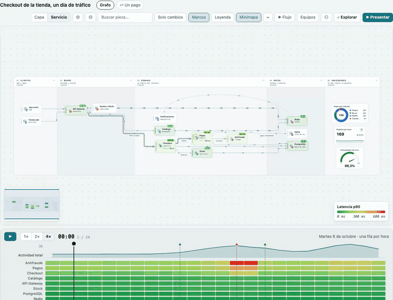

</div>

Los diagramas de arquitectura envejecen porque son dibujos. Los de GraphX son **datos**: servicios, equipos,
latencias, caudales, incidentes y despliegues van en el JSON, y el diagrama los dibuja, los anima y deja que quien
lo lee los explore.

<table>
<tr>
<td width="33%" valign="top">
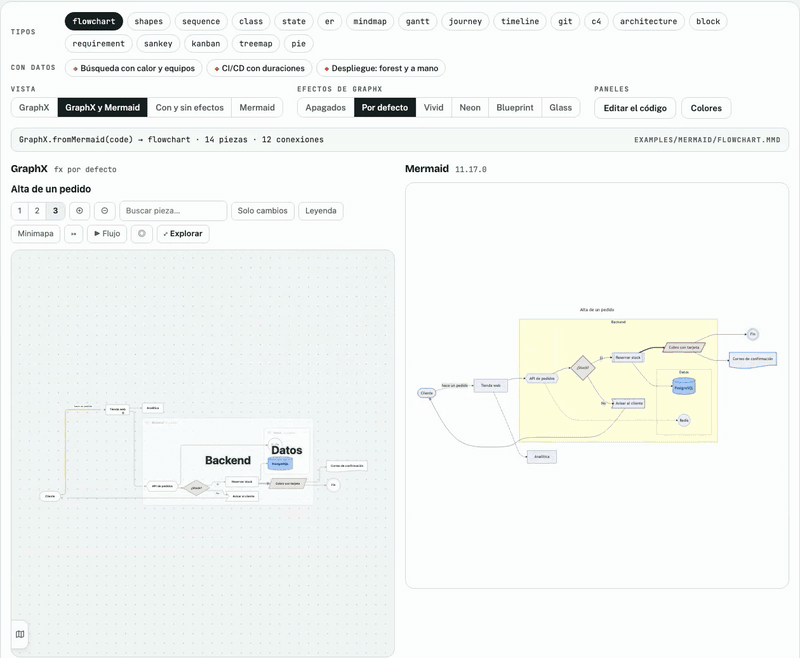<br>
<b>🧜 Los 19 tipos de Mermaid</b><br>
<sub>convertidos sin Mermaid, con sus formas, notas y fronteras</sub>
</td>
<td width="33%" valign="top">
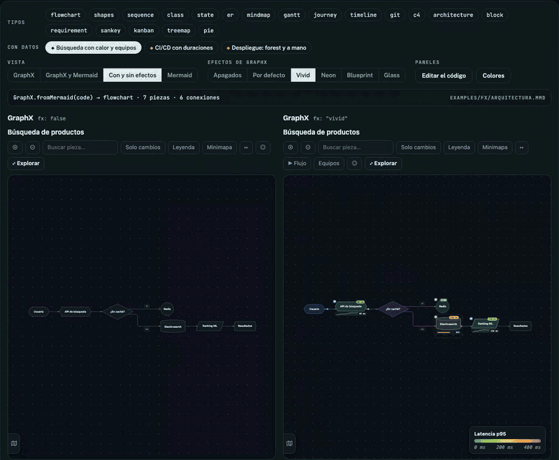<br>
<b>✨ Efectos y pieles</b><br>
<sub><code>vivid</code>, <code>neon</code>, <code>blueprint</code>, <code>glass</code>… o <code>fx: false</code></sub>
</td>
<td width="33%" valign="top">
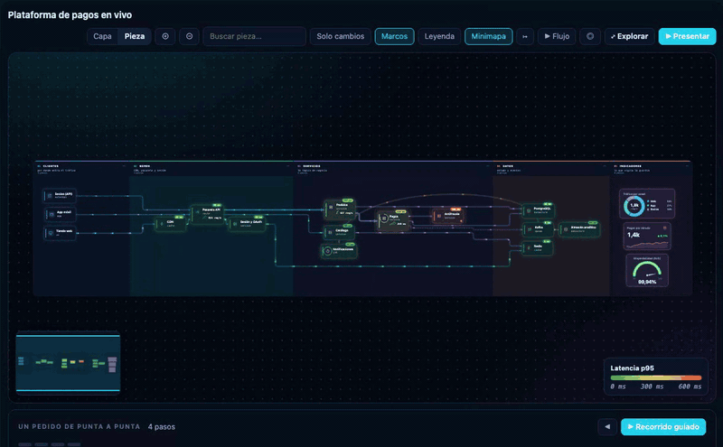<br>
<b>🌊 Datos en vivo</b><br>
<sub><code>setData()</code>: caudal, calor, KPI e incidentes</sub>
</td>
</tr>
<tr>
<td width="33%" valign="top">
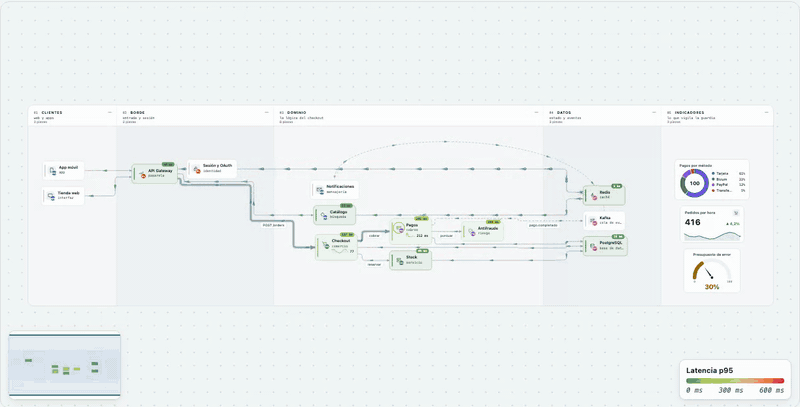<br>
<b>💥 Radio de impacto</b><br>
<sub>qué se rompe, salto a salto, y a qué equipos llamar</sub>
</td>
<td width="33%" valign="top">
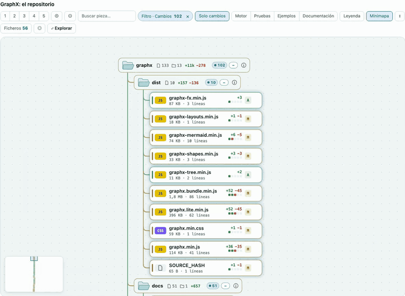<br>
<b>🗂 Árboles de ficheros</b><br>
<sub>un repositorio con el diff de la rama</sub>
</td>
<td width="33%" valign="top">
<br>
<b>🤖 En Claude Code</b><br>
<sub>el mismo diagrama en el terminal, paso a paso</sub>
</td>
</tr>
</table>

```bash
node graphx-build.mjs examples/onboarding-proceso.json --out /tmp/onboarding.html && open /tmp/onboarding.html
```

---

<details>
<summary><h3>🧭 Por qué GraphX</h3></summary>

| | |
|---|---|
| 🧭 **Navegable** | layout jerárquico con ELK, niveles que se abren en su sitio, búsqueda, trazado de dependencias, recorrido guiado y modo presentación |
| 🌊 **Vivo** | partículas por caudal, mapas de calor, sparklines, anillos de progreso, alertas y `setData()` para datos en vivo |
| ⏱ **Con tiempo** | una línea de tiempo desde cualquier tabla TSV/CSV: recorre un día de tráfico y mira cómo ocurre el incidente |
| 💥 **Con impacto** | radio de impacto: qué deja de funcionar si esta pieza falla, salto a salto |
| 🧜 **Compatible con Mermaid** | los 19 tipos de diagrama de Mermaid, convertidos sin Mermaid, con datos ricos opcionales en `@{…}` y `%% @gx` |
| ⚛️ **Listo para React** | cada forma es una función pura, con componentes de React que dibujan exactamente lo mismo que el motor |
| 🎛 **Configurable** | cada efecto se enciende o se apaga con `fx`; `fx: false` es el diagrama de siempre, tal cual |
| 📦 **Portable** | un solo `<script>`; no pide al navegador más que SVG; funciona sin red con el bundle completo |

La [demo en vivo](docs/demo/es/index.html) lo reúne todo en una página con nueve pestañas: **Software**, **Casos de
uso**, **Diagramas**, **Piezas**, **Formas**, **Árbol**, **Atlas** (un sistema visto desde varias perspectivas, con
las piezas compartidas), **En vivo** y una **Guía** de cada asset y cada efecto.


</details>

<details>
<summary><h3>🧜 Los 19 tipos de Mermaid, al lado de Mermaid</h3></summary>

Pega cualquier diagrama de Mermaid y GraphX lo convierte, con sus formas, notas, fronteras y puntas de flecha; un
`pie` se convierte en un donut vivo. Cambia los colores del tema o de cada tipo de pieza mientras miras.


<table>
<tr>
<td width="50%">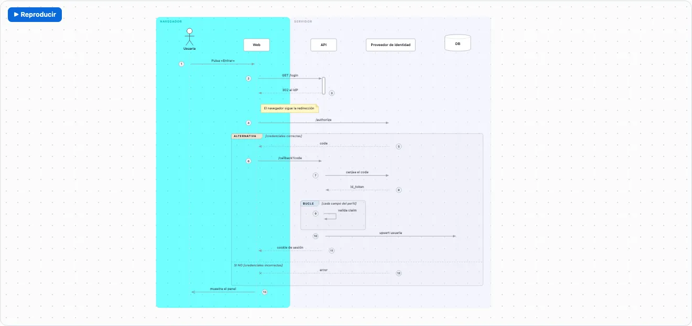<br><sub><b>sequenceDiagram</b> con cajas, notas y bloques</sub></td>
<td width="50%">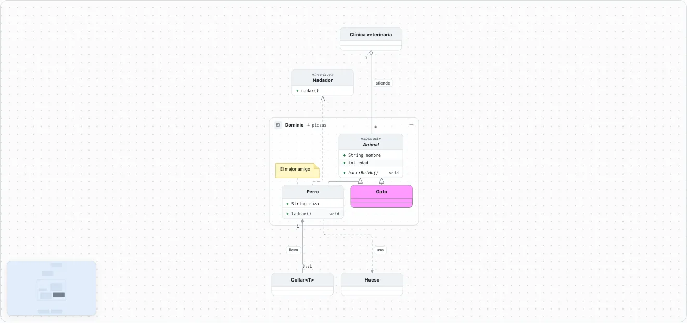<br><sub><b>classDiagram</b> con miembros y relaciones UML</sub></td>
</tr>
<tr>
<td>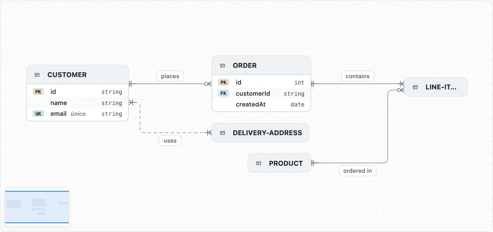<br><sub><b>erDiagram</b> con cardinalidades</sub></td>
<td>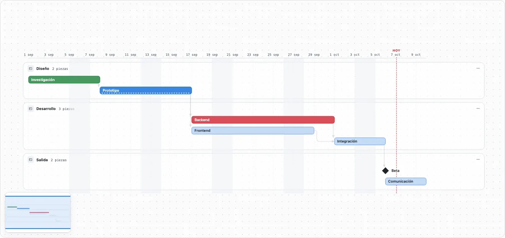<br><sub><b>gantt</b> con hitos y el día de hoy</sub></td>
</tr>
<tr>
<td>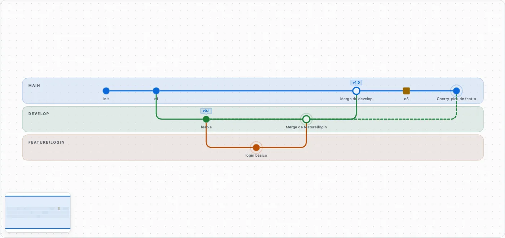<br><sub><b>gitGraph</b> con ramas, merges y tags</sub></td>
<td>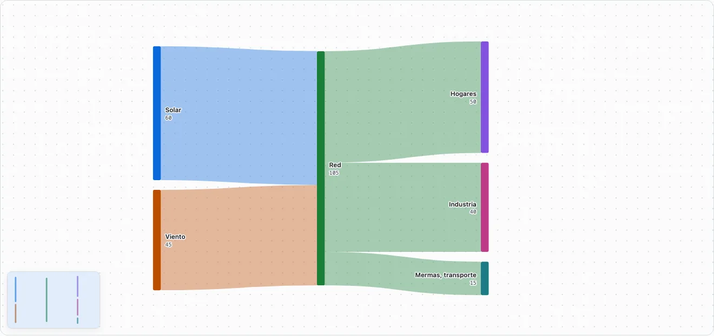<br><sub><b>sankey</b> con caudales proporcionales</sub></td>
</tr>
<tr>
<td>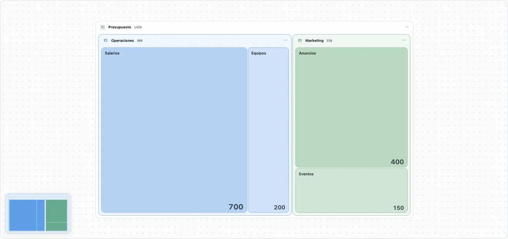<br><sub><b>treemap</b> anidado</sub></td>
<td>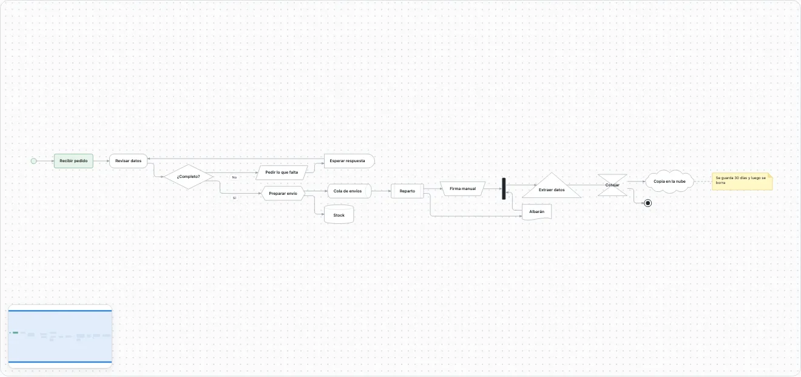<br><sub>las formas de <b>flowchart</b></sub></td>
</tr>
</table>

Sigue siendo Mermaid válido: Mermaid ignora las claves de más y los comentarios `%% @gx`.

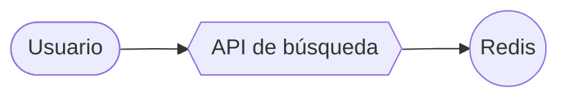
```mermaid
flowchart LR
  usuario([Usuario]) e1@--> buscador{{API de búsqueda}}
  buscador@{ heat: 85, spark: "40 52 61 58 70", owner: busqueda }
  buscador --> cache((Redis))
  e1@{ rate: 900, speed: fast }
  %% @gx buscador { "blocks": [ { "type": "callout", "tone": "warn", "text": "p95 por encima de **80 ms**" } ] }
```

</details>

<details>
<summary><h3>✨ Efectos y pieles, a un clic</h3></summary>

El mismo diagrama con `fx: false` y con los presets `vivid`, `neon`, `blueprint` y `glass`. Cada efecto se enciende
o se apaga por separado; [docs/efectos.md](docs/efectos.md) los clasifica con recetas.


<table>
<tr>
<td width="33%"><br><sub><b>neon</b></sub></td>
<td width="33%"><br><sub><b>blueprint</b></sub></td>
<td width="33%"><br><sub><b>glass</b></sub></td>
</tr>
<tr>
<td><br><sub>partículas por caudal</sub></td>
<td><br><sub>calor, serie, progreso y alertas</sub></td>
<td><br><sub>trazo a mano</sub></td>
</tr>
<tr>
<td><br><sub>ondas al trazar dependencias</sub></td>
<td><br><sub>▶ flujo paso a paso</sub></td>
<td><br><sub>foco sobre una pieza</sub></td>
</tr>
</table>

<br>
<sub>zoom semántico en una PR de 73 piezas</sub>

</details>

<details>
<summary><h3>🌊 Datos en vivo, tiempo e incidentes</h3></summary>

`setData()` cada segundo y medio: las partículas aceleran con el caudal, los colores siguen la latencia p95 y los
KPI cuentan hasta su valor. Provoca un incidente y el mapa traza lo que depende del servicio que falla.


La línea de tiempo sale de cualquier tabla TSV o CSV: recorre un día de tráfico y mira cómo llega el incidente.


```js
const g = GraphX.mount(el, spec, { fx: 'neon', lang: 'es' });
g.setData({ nodes: { api: { heat: 480, alert: 'crit' } }, edges: { e1: { rate: 240 } } });
g.timeline.seek('13:00'); g.blast('api'); g.filterOwners(['datos']);
```

</details>

<details>
<summary><h3>💥 Impacto, equipos y paneles</h3></summary>

Un clic en el panel: anillos por salto, qué se rompe y a qué equipos llamar. Los equipos filtran el mapa y el panel
de cada pieza lleva bloques ricos: métricas, avisos, tablas, enlaces y su vecindad.


<table>
<tr>
<td width="50%"><br><sub>el impacto de Antifraude</sub></td>
<td width="50%"><br><sub>filtrar por un equipo</sub></td>
</tr>
<tr>
<td><br><sub>los bloques del panel</sub></td>
<td><br><sub>un repositorio como árbol, con su diff</sub></td>
</tr>
</table>

</details>

<details>
<summary><h3>🧩 61 formas, en el motor y en React</h3></summary>

Flowchart, C4, tablas de ER y UML, commits de git, barras de gantt, tickets de kanban, KPI, gauge, donut, ficheros
y carpetas… y 12 puntas de arista, dibujadas por `GraphXShape` desde el mismo árbol SVG que usa el motor.

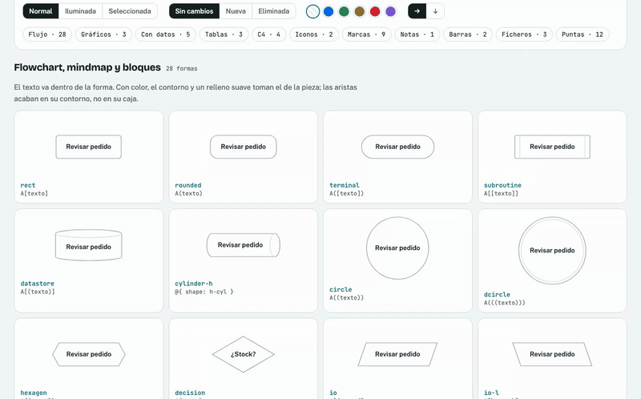

<table>
<tr>
<td width="50%">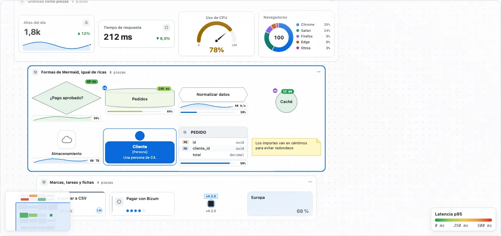<br><sub>formas con datos</sub></td>
<td width="50%">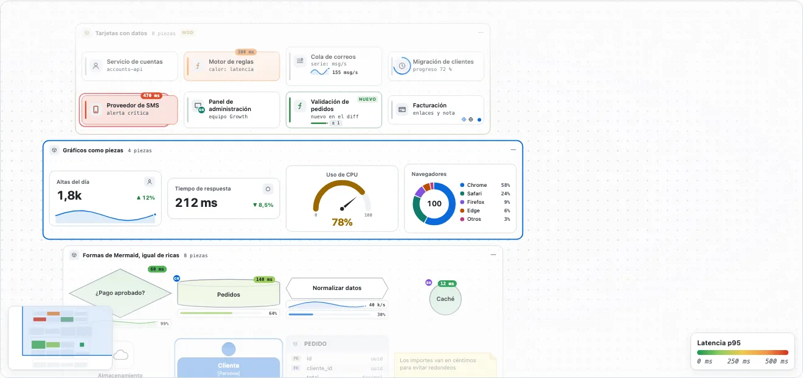<br><sub>KPI, gauge y donut</sub></td>
</tr>
</table>

```jsx
const { GraphX, GraphXShape } = GraphXReactFactory(React, () => window.GraphX);
<GraphX mermaid={texto} fx="glass" lang="es" />
<GraphXShape node={{ shape: 'gauge', label: 'CPU', value: 72, unit: '%', thresholds: [70, 90] }} />
```

</details>

<details>
<summary><h3>🗂 Diez casos de uso reales</h3></summary>

Todos están en [`examples/`](examples) (y en inglés en `examples/en/`); [docs/ejemplos.md](docs/ejemplos.md) los
cuenta uno a uno.

<table>
<tr>
<td width="50%">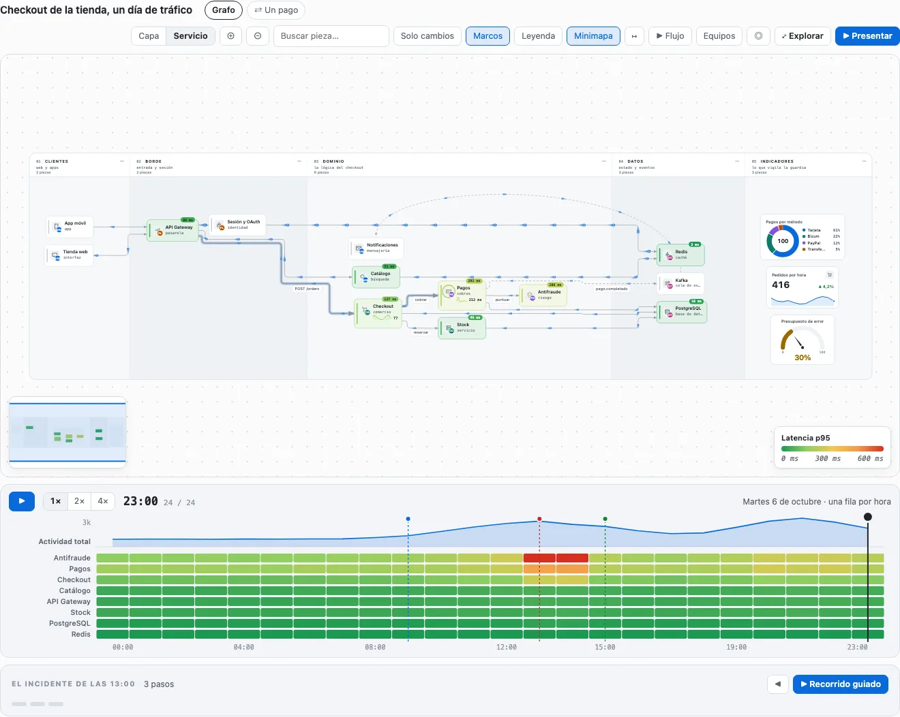<br><sub><b>Checkout de una tienda</b> con su día de tráfico</sub></td>
<td width="50%">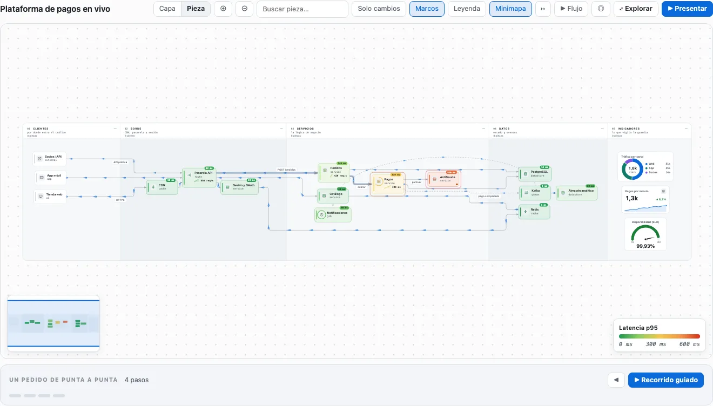<br><sub><b>Plataforma de pagos</b> en vivo</sub></td>
</tr>
<tr>
<td>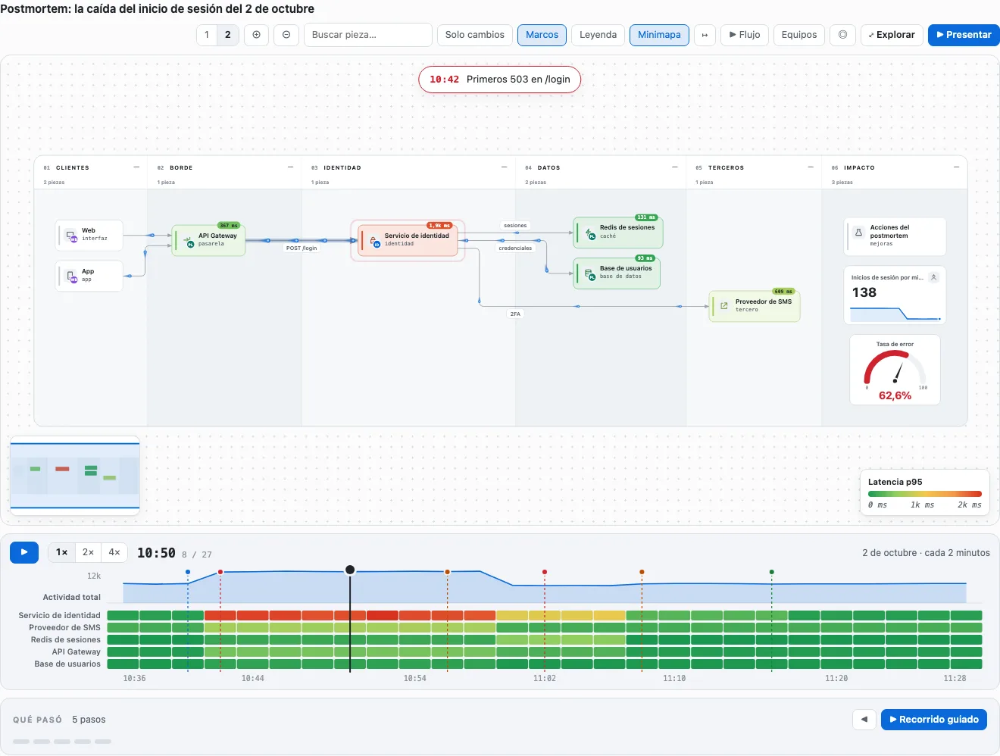<br><sub><b>Postmortem</b> a las 10:50</sub></td>
<td>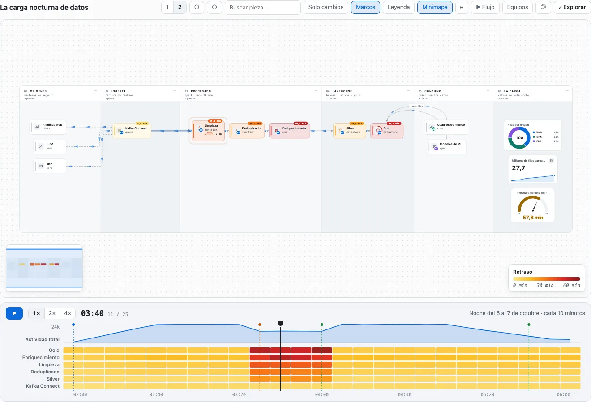<br><sub><b>Pipeline de datos</b>: la carga nocturna</sub></td>
</tr>
<tr>
<td>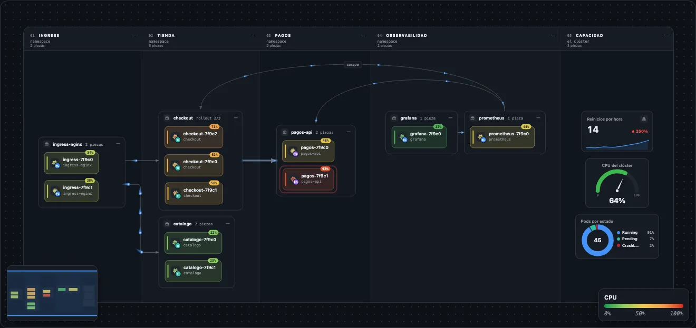<br><sub><b>Kubernetes</b> a nivel de pod</sub></td>
<td>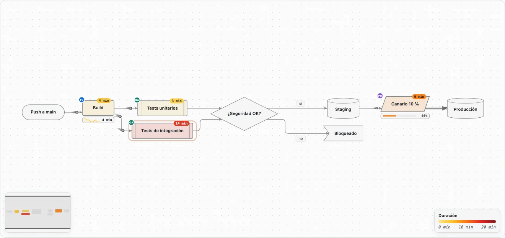<br><sub><b>CI/CD</b></sub></td>
</tr>
<tr>
<td>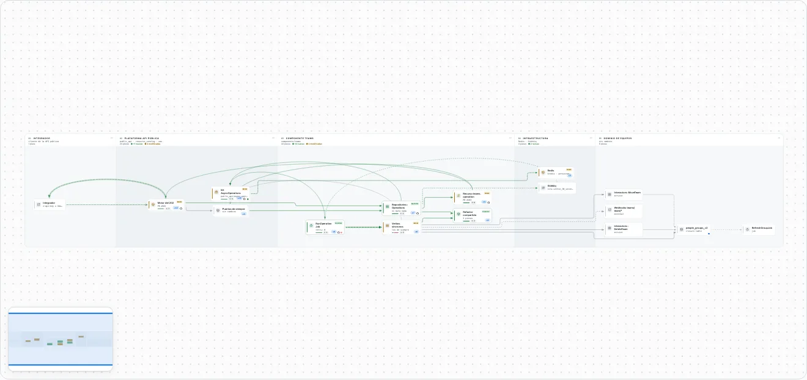<br><sub><b>Revisión de una PR</b></sub></td>
<td>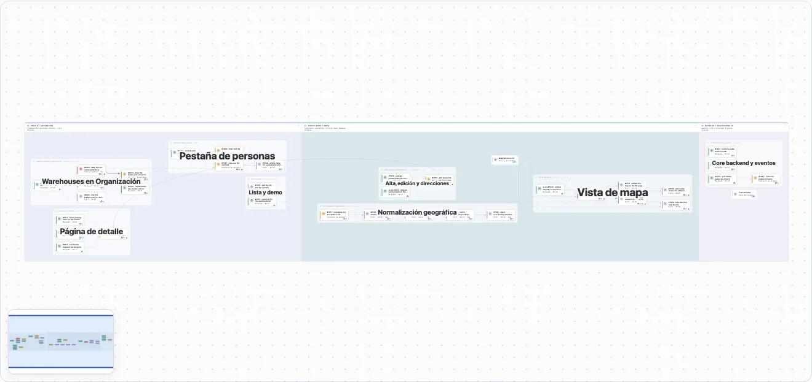<br><sub><b>Radar de PRs</b></sub></td>
</tr>
<tr>
<td>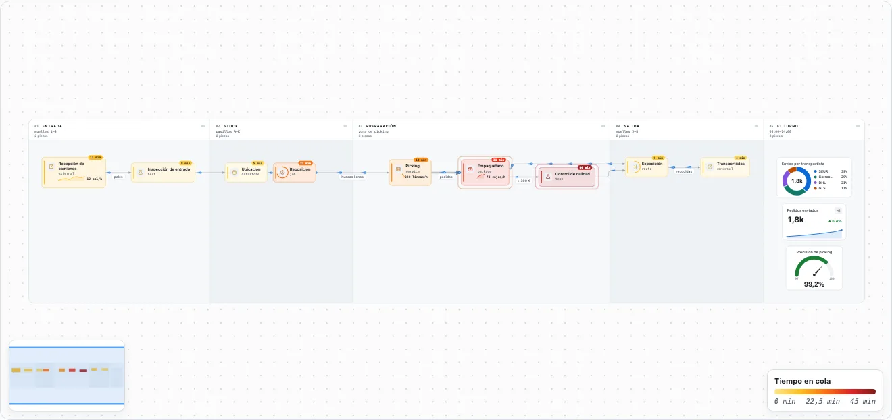<br><sub><b>Almacén</b></sub></td>
<td>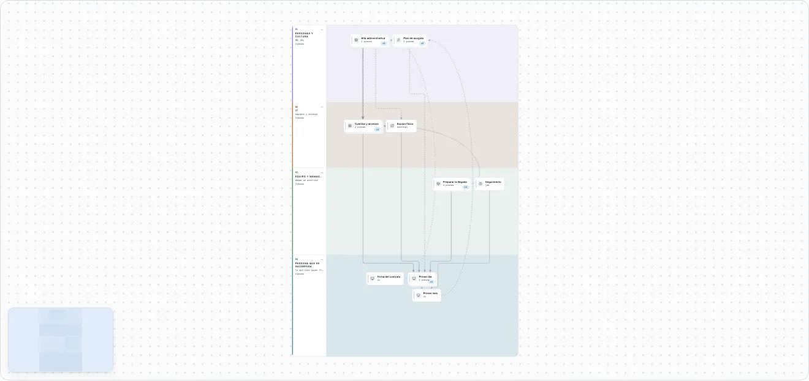<br><sub><b>Incorporación</b> de una persona</sub></td>
</tr>
</table>

</details>

<details open>
<summary><h3>📦 Instalar en Claude Code</h3></summary>

```bash
git clone https://github.com/Sendery/graphx.git && cd graphx
node install.mjs
```

El instalador pregunta con casillas (↑ ↓ mover · espacio marcar · `a` todo · ⏎ instalar) qué pone en `~/.claude`
(o en `$CLAUDE_CONFIG_DIR`):

| | Qué instala | Dónde | Cómo se usa |
|---|---|---|---|
| **Skill** `graphx` | enseña a Claude a dibujar y a explicar con diagramas: qué tipo usar, recorridos guiados, carteles, datos en vivo | `~/.claude/skills/graphx` | `/graphx <lo que quieres dibujar>` · `/graphx help` |
| **Mod para el terminal** `graphx-mod` | el plugin: el lienzo de caracteres en el panel, el visor del navegador, las herramientas `mcp__graphx-mod__*` y los bloques Mermaid dibujados en el transcript | `~/.claude/skills/graphx-mod` | `/graphx-mod` · `/graphx-mod help` · `/graphx-mod open` |
| **Mod para la app de escritorio** | el mismo mod y la ruta absoluta de `node` (una app abierta desde el Dock no hereda el `PATH` de tu shell) | `~/.claude/skills/graphx-mod/node-path` | reinicia Claude Desktop |

La skill y el mod van separados a propósito: `/graphx` es la skill (pides en lenguaje normal) y `/graphx-mod` es el mod
(el lienzo, sus comandos y sus teclas). Cada uno tiene su `help`. La skill funciona sin el mod (dibuja bloques Mermaid
normales) y el mod sin la skill (Claude lo aprende de las descripciones de sus herramientas), pero juntos funcionan
mejor.

Sin preguntas: `node install.mjs --skill --terminal --desktop` (o `--all`, y `--yes` para lo preseleccionado),
`--uninstall` para quitarlo, `--dry-run` para ver qué haría y `--lang es|en`. Necesita `node` ≥ 18; hace `npm install`
y genera `dist/` si faltan. Opcional: `rsvg-convert` (librsvg) para la imagen del motor en kitty/Ghostty/WezTerm y para
las capturas.

**Idioma.** Todos los botones, mensajes y ayudas del mod están en español y en inglés: sigue la opción `language` del
mod (`/config`), si no el `language` de Claude Code, si no `LANG`, y si nada lo dice, inglés.
`/graphx-mod caps lang=es` lo cambia para la sesión.

</details>

<details>
<summary><h3>🤖 También en Claude Code</h3></summary>

La carpeta [`mod/`](mod/README.md) es un plugin de Claude Code (`graphx-mod`, se instala con `node install.mjs`) que dibuja cualquier diagrama de GraphX dentro de
la sesión: Claude dibuja con herramientas y tú lo navegas con el teclado y el ratón. En el terminal vuelve a
colocar el grafo en celdas a cualquier tamaño (tarjetas, fichas, compacto, vista general o esquema), detecta la
profundidad de color, los caracteres y el tema, anima los efectos y presenta el recorrido paso a paso con sus
explicaciones.


<table>
<tr>
<td width="50%"><br><sub>zoom semántico: tarjetas, fichas y vista general</sub></td>
<td width="50%"><br><sub>✺ impacto y trazado</sub></td>
</tr>
</table>

<br>
<sub>doce tipos de Mermaid en el terminal · <a href="mod/README.md">todo el mod →</a></sub>

</details>

<details>
<summary><h3>🚀 Empezar en un minuto</h3></summary>

```bash
node graphx-build.mjs examples/onboarding-proceso.json --out /tmp/onboarding.html
open /tmp/onboarding.html
```

El ensamblador valida antes de escribir (ids duplicados, extremos que no existen, colores no válidos, enlaces
inseguros…) y acepta `.json`, `.mmd` y Markdown con un bloque ` ```mermaid `. Con `--strict` los avisos también
fallan, `--mode lite` carga ELK de un CDN (≈135 KB con gzip) y `--lang en` genera los textos en inglés.

**El diagrama más pequeño**

```json
{
  "title": "Checkout",
  "nodes": [
    { "id": "web", "label": "Tienda web", "kind": "ui", "summary": "Donde los clientes hacen sus pedidos." },
    { "id": "api", "label": "API de pedidos", "kind": "service", "summary": "Crea y valora los pedidos.",
      "heat": 212, "spark": [180, 190, 240, 212] },
    { "id": "db", "label": "PostgreSQL", "kind": "datastore", "summary": "Pedidos y clientes.", "owner": "datos" }
  ],
  "edges": [
    { "id": "e1", "from": "web", "to": "api", "kind": "http", "rate": 900 },
    { "id": "e2", "from": "api", "to": "db", "kind": "data" }
  ],
  "fx": "vivid"
}
```

**En una página**

```html
<script src="dist/graphx.bundle.min.js"></script>
<div data-gx data-height="640" data-fx="vivid">
  <script type="application/json" class="gx-spec">{ …el JSON… }</script>
</div>
```

```js
const g = GraphX.mount(el, spec, { fx: 'neon', lang: 'es' });   // o GraphX.mountMermaid(el, texto)
```

</details>

<details>
<summary><h3>📦 Qué trae</h3></summary>

| Fichero | Qué es | Peso (gzip) |
|---|---|---|
| `dist/graphx.bundle.min.js` | todo en un `<script>`, ELK incluido, funciona sin red | 1,8 MB (564 KB) |
| `dist/graphx.lite.min.js` | lo mismo sin ELK, que se carga de jsDelivr la primera vez | 396 KB (135 KB) |
| `dist/graphx-fx.min.js` | el módulo de efectos suelto (los bundles ya lo llevan) | 87 KB (29 KB) |
| `graphx.js` · `graphx.css` | el motor y su tema por tokens (claro y oscuro) | |
| `graphx-mermaid.js` | conversor de Mermaid → JSON de GraphX, sin depender de Mermaid | |
| `graphx-shapes.js` · `graphx-layouts.js` · `graphx-tree.js` | formas, layouts propios (gantt, git, sankey, treemap…) y árboles de ficheros | |
| `graphx-fx.js` | efectos, datos en vivo, línea de tiempo, impacto, equipos y bloques ricos del panel | |
| `react/` | componentes de React sobre las mismas formas | |
| `graphx-build.mjs` | valida y genera una página autocontenida | |
| `examples/` · `examples/en/` | todos los ejemplos, en castellano y en inglés | |
| `mod/` | el mod de Claude Code `graphx-mod`: terminal, escritorio y navegador ([mod/README.md](mod/README.md)) | |
| `skills/graphx/` | la skill de Claude Code `graphx` | |
| `install.mjs` | el instalador interactivo de la skill y el mod | |

</details>

<details>
<summary><h3>📚 Documentación</h3></summary>

| | |
|---|---|
| [docs/referencia.md](docs/referencia.md) | el JSON campo a campo, la API y las herramientas |
| [docs/catalogo.md](docs/catalogo.md) | cada asset por familia: tarjetas, formas, gráficos, contenedores, aristas, iconos, bloques, layouts y color |
| [docs/efectos.md](docs/efectos.md) | los efectos, clasificados por lo que hacen, con recetas |
| [docs/demo.md](docs/demo.md) · [docs/ejemplos.md](docs/ejemplos.md) | el showcase pestaña a pestaña y cada ejemplo |
| [mod/README.md](mod/README.md) | el mod de Claude Code |

</details>

<details>
<summary><h3>🛠 Desarrollo</h3></summary>

```bash
node tools/build-dist.mjs                                   # regenera dist/
node tools/verify.mjs && node tools/verify-mermaid.mjs      # pruebas sin navegador (jsdom)
node tools/verify-shapes.mjs && node tools/verify-tree.mjs && node tools/verify-fx.mjs
node examples/fx/build.mjs docs/demo/es/index.html --standalone --lang es   # regenera la demo
node tools/capture-gifs.mjs                                 # vuelve a grabar los GIF (Playwright + ffmpeg)
node mod/tools/capture-media.mjs                            # vuelve a grabar las capturas del mod de Claude Code (ffmpeg)
node tools/release.mjs --tag v1.9.0-rc.1                    # los distribuibles clasificados de una versión, en release/<tag>/
```

La página en inglés sale de la misma plantilla: `examples/fx/showcase.en.txt` guarda las traducciones y el build
falla si queda castellano en la página.

</details>

<sub>Construido en septiembre de 2026. ELK es EPL-2.0 (https://eclipse.dev/elk).</sub>
