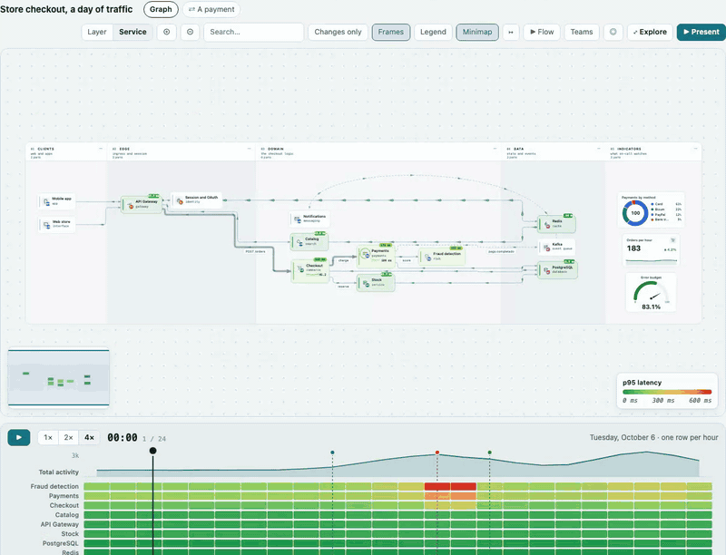
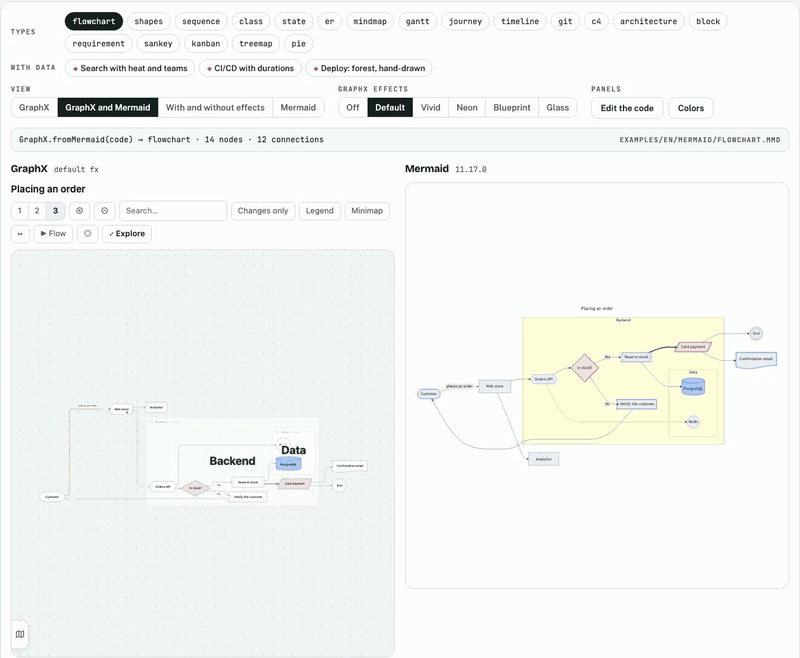
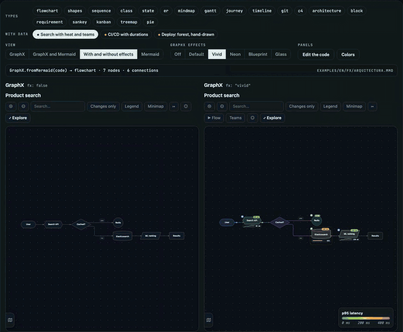
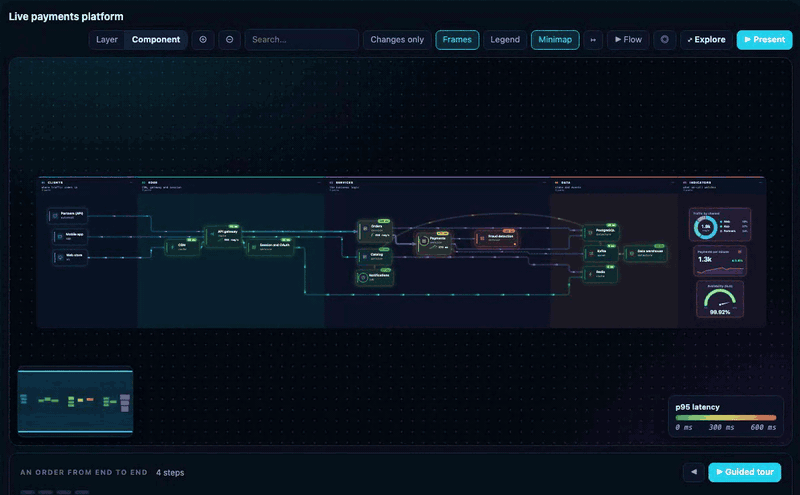
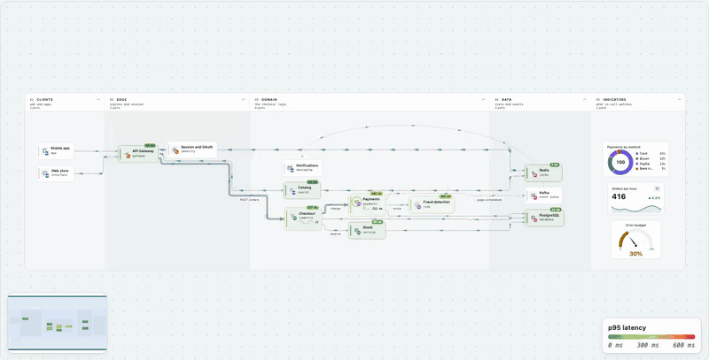
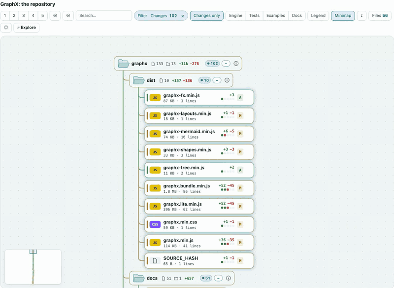
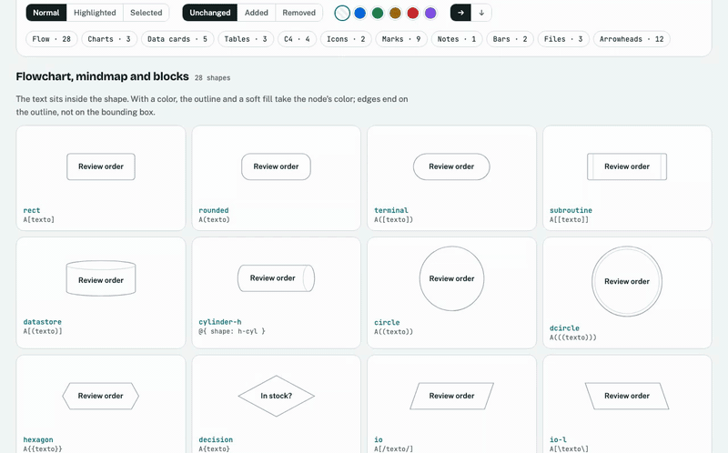

<div align="center">

# GraphX

### Diagrams that move with their data

**One JSON (or one Mermaid block) → one self-contained, navigable, animated page.**
No server, no build step, no framework. It runs as a local file, a claude.ai artifact or a block inside any web page.


**English** · [Español](README.es.md)

### [▶ Live demo](docs/demo/index.html) · [Demo en español](docs/demo/es/index.html)

<sub>Download and open the HTML file, or serve <code>docs/</code> with GitHub Pages: the demo lives at <code>/demo/</code>.</sub>



</div>

Architecture diagrams go stale because they are pictures. GraphX diagrams are **data**: services, teams, latency,
throughput, incidents and deploys go in the JSON, and the diagram draws them, animates them and lets the reader
explore them.

<table>
<tr>
<td width="33%" valign="top">
<br>
<b>🧜 All 19 Mermaid types</b><br>
<sub>converted without Mermaid, with their shapes, notes and boundaries</sub>
</td>
<td width="33%" valign="top">
<br>
<b>✨ Effects and skins</b><br>
<sub><code>vivid</code>, <code>neon</code>, <code>blueprint</code>, <code>glass</code>… or <code>fx: false</code></sub>
</td>
<td width="33%" valign="top">
<br>
<b>🌊 Live data</b><br>
<sub><code>setData()</code>: throughput, heat, KPIs and incidents</sub>
</td>
</tr>
<tr>
<td width="33%" valign="top">
<br>
<b>💥 Blast radius</b><br>
<sub>what breaks, hop by hop, and which teams to call</sub>
</td>
<td width="33%" valign="top">
<br>
<b>🗂 File trees</b><br>
<sub>a repository with the branch's diff</sub>
</td>
<td width="33%" valign="top">
<br>
<b>🤖 In Claude Code</b><br>
<sub>the same diagram in the terminal, step by step</sub>
</td>
</tr>
</table>

```bash
node graphx-build.mjs examples/onboarding-proceso.json --out /tmp/onboarding.html && open /tmp/onboarding.html
```

---

<details>
<summary><h3>🧭 Why GraphX</h3></summary>

| | |
|---|---|
| 🧭 **Navigable** | hierarchical ELK layout, levels that open in place, search, dependency tracing, a guided tour and presentation mode |
| 🌊 **Alive** | particles by throughput, heat maps, sparklines, progress rings, alerts, and `setData()` for live updates |
| ⏱ **Time-aware** | a timeline from any TSV/CSV table: scrub through a day of traffic and watch the incident happen |
| 💥 **Impact-aware** | blast radius: what stops working if this node fails, hop by hop |
| 🧜 **Mermaid-compatible** | all 19 Mermaid diagram types, converted without Mermaid, with optional rich data in `@{…}` and `%% @gx` |
| ⚛️ **React-ready** | every shape as a pure function, with React components that draw exactly what the engine draws |
| 🎛 **Configurable** | every effect switches on or off with `fx`; `fx: false` is the plain diagram, byte for byte |
| 📦 **Portable** | one `<script>`; no browser requirements beyond SVG; works offline with the full bundle |

The [live demo](docs/demo/index.html) puts everything on one page, in nine tabs: **Software**, **Use cases**,
**Diagrams**, **Nodes**, **Shapes**, **File tree**, **Atlas** (one system seen from several perspectives, with shared
nodes), **Live** and a **Guide** to every asset and effect.


</details>

<details>
<summary><h3>🧜 All 19 Mermaid types, side by side with Mermaid</h3></summary>

Paste any Mermaid diagram and GraphX converts it, with the same shapes, notes, boundaries and arrowheads; a `pie`
becomes a live donut. Recolor the theme or each node kind while you watch.


<table>
<tr>
<td width="50%"><br><sub><b>sequenceDiagram</b> with boxes, notes and blocks</sub></td>
<td width="50%"><br><sub><b>classDiagram</b> with members and UML relations</sub></td>
</tr>
<tr>
<td><br><sub><b>erDiagram</b> with cardinalities</sub></td>
<td><br><sub><b>gantt</b> with milestones and today's line</sub></td>
</tr>
<tr>
<td><br><sub><b>gitGraph</b> with branches, merges and tags</sub></td>
<td><br><sub><b>sankey</b> with proportional flows</sub></td>
</tr>
<tr>
<td><br><sub>nested <b>treemap</b></sub></td>
<td><br><sub>the <b>flowchart</b> shapes</sub></td>
</tr>
</table>

Still valid Mermaid: Mermaid ignores the extra keys and the `%% @gx` comments.


</details>

<details>
<summary><h3>✨ Effects and skins, one switch away</h3></summary>

The same diagram with `fx: false` and with the `vivid`, `neon`, `blueprint` and `glass` presets. Every effect
switches on or off on its own; [docs/efectos.md](docs/efectos.md) sorts them by what they do, with recipes.


<table>
<tr>
<td width="33%"><br><sub><b>neon</b></sub></td>
<td width="33%"><br><sub><b>blueprint</b></sub></td>
<td width="33%"><br><sub><b>glass</b></sub></td>
</tr>
<tr>
<td><br><sub>particles by throughput</sub></td>
<td><br><sub>heat, series, progress and alerts</sub></td>
<td><br><sub>hand-drawn look</sub></td>
</tr>
<tr>
<td><br><sub>ripples while tracing dependencies</sub></td>
<td><br><sub>▶ step-by-step flow</sub></td>
<td><br><sub>focus on one node</sub></td>
</tr>
</table>

<br>
<sub>semantic zoom on a 73-node pull request</sub>

</details>

<details>
<summary><h3>🌊 Live data, time and incidents</h3></summary>

`setData()` every second and a half: particles speed up with throughput, colors follow p95 latency and the KPIs
count up. Trigger an incident and the map traces what depends on the failing service.


The timeline comes from any TSV or CSV table: scrub through a day of traffic and watch the incident arrive.


```js
const g = GraphX.mount(el, spec, { fx: 'neon', lang: 'en' });
g.setData({ nodes: { api: { heat: 480, alert: 'crit' } }, edges: { e1: { rate: 240 } } });
g.timeline.seek('13:00'); g.blast('api'); g.filterOwners(['data']);
```

</details>

<details>
<summary><h3>💥 Blast radius, teams and panels</h3></summary>

One click in the panel: rings per hop, what breaks, which teams to call. Teams filter the map, and each node's
panel carries rich blocks: metrics, callouts, tables, links and its neighbourhood.


<table>
<tr>
<td width="50%"><br><sub>the blast radius of the fraud service</sub></td>
<td width="50%"><br><sub>filtering by one team</sub></td>
</tr>
<tr>
<td><br><sub>the panel's blocks</sub></td>
<td><br><sub>a repository as a tree, with its diff</sub></td>
</tr>
</table>

</details>

<details>
<summary><h3>🧩 61 shapes, in the engine and in React</h3></summary>

Flowchart, C4, ER and UML tables, git commits, gantt bars, kanban tickets, KPI, gauge, donut, files and folders…
plus 12 arrowheads, drawn by `GraphXShape` from the same SVG tree the engine uses.



<table>
<tr>
<td width="50%"><br><sub>shapes with data</sub></td>
<td width="50%"><br><sub>KPI, gauge and donut</sub></td>
</tr>
</table>

```jsx
const { GraphX, GraphXShape } = GraphXReactFactory(React, () => window.GraphX);
<GraphX mermaid={text} fx="glass" lang="en" />
<GraphXShape node={{ shape: 'gauge', label: 'CPU', value: 72, unit: '%', thresholds: [70, 90] }} />
```

</details>

<details>
<summary><h3>🗂 Ten real use cases</h3></summary>

They all live in [`examples/`](examples) (in English in `examples/en/`); [docs/ejemplos.md](docs/ejemplos.md)
walks through each one.

<table>
<tr>
<td width="50%"><br><sub><b>A store's checkout</b> with its day of traffic</sub></td>
<td width="50%"><br><sub><b>A payments platform</b>, live</sub></td>
</tr>
<tr>
<td><br><sub><b>Postmortem</b> at 10:50</sub></td>
<td><br><sub><b>Data pipeline</b>: the nightly load</sub></td>
</tr>
<tr>
<td><br><sub><b>Kubernetes</b> at pod level</sub></td>
<td><br><sub><b>CI/CD</b></sub></td>
</tr>
<tr>
<td><br><sub><b>Reviewing a pull request</b></sub></td>
<td><br><sub><b>PR radar</b></sub></td>
</tr>
<tr>
<td><br><sub><b>Warehouse</b></sub></td>
<td><br><sub><b>Onboarding</b> a new hire</sub></td>
</tr>
</table>

</details>

<details open>
<summary><h3>📦 Install in Claude Code</h3></summary>

```bash
git clone https://github.com/Sendery/graphx.git && cd graphx
node install.mjs
```

The installer asks with checkboxes (↑ ↓ move · space toggle · `a` all · ⏎ install) what to put into
`~/.claude` (or `$CLAUDE_CONFIG_DIR`):

| | What it installs | Where | Use it with |
|---|---|---|---|
| **Skill** `graphx` | teaches Claude to draw and explain with diagrams: when to use which type, guided tours, signs, live data | `~/.claude/skills/graphx` | `/graphx <what you want drawn>` · `/graphx help` |
| **Mod for the terminal** `graphx-mod` | the plugin: the character canvas in the panel, the browser viewer, the `mcp__graphx-mod__*` tools and Mermaid blocks drawn in the transcript | `~/.claude/skills/graphx-mod` | `/graphx-mod` · `/graphx-mod help` · `/graphx-mod open` |
| **Mod for the desktop app** | the same mod, plus the absolute path to `node` (an app launched from the Dock does not inherit your shell's `PATH`) | `~/.claude/skills/graphx-mod/node-path` | restart Claude Desktop |

The skill and the mod are separate on purpose: `/graphx` is the skill (ask in plain language), `/graphx-mod` is the
mod (the canvas, its commands and keys). Each has its own `help`. The skill works without the mod (it falls back to
plain Mermaid blocks); the mod works without the skill (Claude learns it from the tool descriptions), but together
they are best.

Without questions: `node install.mjs --skill --terminal --desktop` (or `--all`, `--yes` for the preselection),
`--uninstall` to remove, `--dry-run` to preview and `--lang es|en`. It needs `node` ≥ 18; it runs `npm install` and
builds `dist/` if they are missing. Optional: `rsvg-convert` (librsvg) for the engine image in kitty/Ghostty/WezTerm and
for screenshots.

**Language.** Every button, message and help of the mod is in English and Spanish: it follows the mod's `language`
option (`/config`), else Claude Code's `language` setting, else `LANG`, and defaults to English.
`/graphx-mod caps lang=en` switches it for the session.

</details>

<details>
<summary><h3>🤖 In Claude Code, too</h3></summary>

The [`mod/`](mod/README.md) folder is a Claude Code plugin (`graphx-mod`, installed with `node install.mjs`) that draws any GraphX diagram inside the session:
Claude draws with tools, and you navigate with the keyboard and the mouse. In the terminal it redraws the graph
in character cells at any size (cards, chips, compact, overview or an outline), detects color depth, glyph set
and theme, plays the effects, and runs the guided tour step by step with its explanations.


<table>
<tr>
<td width="50%"><br><sub>semantic zoom: cards, chips and overview</sub></td>
<td width="50%"><br><sub>✺ blast radius and tracing</sub></td>
</tr>
</table>

<br>
<sub>twelve Mermaid types in the terminal · <a href="mod/README.md">the whole mod →</a></sub>

</details>

<details>
<summary><h3>🚀 Quick start</h3></summary>

```bash
node graphx-build.mjs examples/onboarding-proceso.json --out /tmp/onboarding.html
open /tmp/onboarding.html
```

The builder validates before it writes (duplicate ids, missing endpoints, invalid colors, unsafe links…) and
accepts `.json`, `.mmd` and Markdown with a ` ```mermaid ` block. Use `--strict` to fail on warnings,
`--mode lite` to load ELK from a CDN (≈135 KB gzipped) and `--lang en` for English text.

**The smallest diagram**

```json
{
  "title": "Checkout",
  "nodes": [
    { "id": "web", "label": "Web store", "kind": "ui", "summary": "Where customers place orders." },
    { "id": "api", "label": "Orders API", "kind": "service", "summary": "Creates and prices orders.",
      "heat": 212, "spark": [180, 190, 240, 212] },
    { "id": "db", "label": "PostgreSQL", "kind": "datastore", "summary": "Orders and customers.", "owner": "data" }
  ],
  "edges": [
    { "id": "e1", "from": "web", "to": "api", "kind": "http", "rate": 900 },
    { "id": "e2", "from": "api", "to": "db", "kind": "data" }
  ],
  "fx": "vivid"
}
```

**In a page**

```html
<script src="dist/graphx.bundle.min.js"></script>
<div data-gx data-height="640" data-fx="vivid">
  <script type="application/json" class="gx-spec">{ …the JSON… }</script>
</div>
```

```js
const g = GraphX.mount(el, spec, { fx: 'neon', lang: 'en' });   // or GraphX.mountMermaid(el, text)
```

</details>

<details>
<summary><h3>📦 What's in the box</h3></summary>

| File | What it is | Size (gzip) |
|---|---|---|
| `dist/graphx.bundle.min.js` | everything in one `<script>`, ELK included, works offline | 1.8 MB (564 KB) |
| `dist/graphx.lite.min.js` | the same without ELK, loaded from jsDelivr on first use | 396 KB (135 KB) |
| `dist/graphx-fx.min.js` | the effects module alone (the bundles already include it) | 87 KB (29 KB) |
| `graphx.js` · `graphx.css` | the engine and its token-based theme (light and dark) | |
| `graphx-mermaid.js` | Mermaid → GraphX JSON converter, no Mermaid dependency | |
| `graphx-shapes.js` · `graphx-layouts.js` · `graphx-tree.js` | shapes, built-in layouts (gantt, git, sankey, treemap…) and file trees | |
| `graphx-fx.js` | effects, live data, timeline, blast radius, teams and rich panel blocks | |
| `react/` | React components over the same shapes | |
| `graphx-build.mjs` | validates and emits a self-contained page | |
| `examples/` · `examples/en/` | every example, in Spanish and in English | |
| `mod/` | the Claude Code mod `graphx-mod`: terminal, desktop and browser ([mod/README.md](mod/README.md)) | |
| `skills/graphx/` | the Claude Code skill `graphx` | |
| `install.mjs` | the interactive installer for the skill and the mod | |

</details>

<details>
<summary><h3>📚 Documentation</h3></summary>

The full documentation is written in Spanish:

| | |
|---|---|
| [docs/referencia.md](docs/referencia.md) | the JSON field by field, the API, the tools |
| [docs/catalogo.md](docs/catalogo.md) | every asset by family: cards, shapes, charts, containers, edges, icons, blocks, layouts, color |
| [docs/efectos.md](docs/efectos.md) | the effects, classified by what they do, with recipes |
| [docs/demo.md](docs/demo.md) · [docs/ejemplos.md](docs/ejemplos.md) | the showcase tab by tab, and every example |
| [mod/README.md](mod/README.md) | the Claude Code mod |

</details>

<details>
<summary><h3>🛠 Develop</h3></summary>

```bash
node tools/build-dist.mjs                                   # rebuild dist/
node tools/verify.mjs && node tools/verify-mermaid.mjs      # tests without a browser (jsdom)
node tools/verify-shapes.mjs && node tools/verify-tree.mjs && node tools/verify-fx.mjs
node examples/fx/build.mjs docs/demo/index.html --standalone --lang en   # rebuild the live demo
node tools/capture-gifs.mjs                                 # re-record the GIFs (Playwright + ffmpeg)
node mod/tools/capture-media.mjs                            # re-record the Claude Code mod's captures (ffmpeg)
node tools/release.mjs --tag v1.9.0-rc.1                    # the classified release assets, in release/<tag>/
```

The English page is generated from the same template: `examples/fx/showcase.en.txt` holds the translations and
the build fails if any Spanish is left on the page.

</details>

<sub>Built in September 2026. ELK is EPL-2.0 (https://eclipse.dev/elk).</sub>
