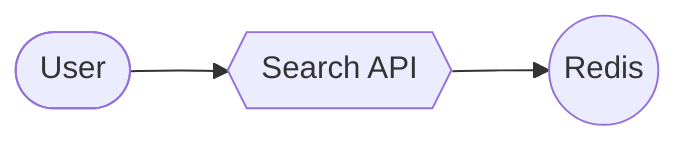

<div align="center">

# GraphX

### Diagrams that move with their data

**One JSON (or one Mermaid block) → one self-contained, navigable, animated page.**
No server, no build step, no framework. It runs as a local file, a claude.ai artifact or a block inside any web page.


**English** · [Español](README.es.md)

### [▶ Live demo](docs/demo/index.html) · [Demo en español](docs/demo/es/index.html)

<sub>Download and open the HTML file, or serve <code>docs/</code> with GitHub Pages: the demo lives at <code>/demo/</code>.</sub>


</div>

---

## Why GraphX

Architecture diagrams go stale because they are pictures. GraphX diagrams are **data**: services, teams, latency,
throughput, incidents and deploys go in the JSON, and the diagram draws them, animates them and lets the reader
explore them.

| | |
|---|---|
| 🧭 **Navigable** | hierarchical ELK layout, levels that open in place, search, dependency tracing, a guided tour and presentation mode |
| 🌊 **Alive** | particles by throughput, heat maps, sparklines, progress rings, alerts, and `setData()` for live updates |
| ⏱ **Time-aware** | a timeline from any TSV/CSV table: scrub through a day of traffic and watch the incident happen |
| 💥 **Impact-aware** | blast radius: what stops working if this node fails, hop by hop |
| 🧜 **Mermaid-compatible** | all 19 Mermaid diagram types, converted without Mermaid, with optional rich data in `@{…}` and `%% @gx` |
| ⚛️ **React-ready** | every shape as a pure function, with React components that draw exactly what the engine draws |
| 🎛 **Configurable** | every effect switches on or off with `fx`; `fx: false` is the plain diagram, byte for byte |
| 📦 **Portable** | one `<script>`; no browser requirements beyond SVG; works offline with the full bundle |

## The showcase

The [live demo](docs/demo/index.html) puts everything on one page, in eight tabs: **Software** (a service map with
its day of traffic), **Use cases** (ten real examples), **Diagrams** (Mermaid vs GraphX), **Nodes**, **Shapes**,
**File tree**, **Live** and a **Guide** to every asset and effect.

### All 19 Mermaid types, side by side with Mermaid

Paste any Mermaid diagram and GraphX converts it, with the same shapes, notes, boundaries and arrowheads; a `pie`
becomes a live donut. Recolor the theme or each node kind while you watch.


### Effects and skins, one switch away

The same diagram with `fx: false` and with the `vivid`, `neon`, `blueprint` and `glass` presets.


### Live data and incidents

`setData()` every second and a half: particles speed up with throughput, colors follow p95 latency and the KPIs
count up. Trigger an incident and the map traces what depends on the failing service.


<table>
<tr>
<td width="50%">

**Blast radius.** One click in the panel: rings per hop, what breaks, which teams to call.


</td>
<td width="50%">

**File trees.** A repository with the branch's diff, filtered as you type.


</td>
</tr>
</table>

### Every shape, in the engine and in React

61 shapes (flowchart, C4, ER and UML tables, git commits, gantt bars, kanban tickets, KPI, gauge, donut, files
and folders…) plus 12 arrowheads, drawn by `GraphXShape` from the same SVG tree the engine uses.


### In Claude Code, too

The [`mod/`](mod/README.md) folder is a Claude Code plugin that draws any GraphX diagram inside the session:
Claude draws with tools, and you navigate with the keyboard and the mouse. In the terminal it redraws the graph
in character cells at any size (cards, chips, compact, overview or an outline), detects color depth, glyph set
and theme, plays the effects, and runs the guided tour step by step with its explanations.


## Quick start

```bash
node graphx-build.mjs examples/onboarding-proceso.json --out /tmp/onboarding.html
open /tmp/onboarding.html
```

The builder validates before it writes (duplicate ids, missing endpoints, invalid colors, unsafe links…) and
accepts `.json`, `.mmd` and Markdown with a ` ```mermaid ` block. Use `--strict` to fail on warnings,
`--mode lite` to load ELK from a CDN (≈135 KB gzipped) and `--lang en` for English text.

### The smallest diagram

```json
{
  "title": "Checkout",
  "nodes": [
    { "id": "web", "label": "Web store", "kind": "ui", "summary": "Where customers place orders." },
    { "id": "api", "label": "Orders API", "kind": "service", "summary": "Creates and prices orders.",
      "heat": 212, "spark": [180, 190, 240, 212] },
    { "id": "db", "label": "PostgreSQL", "kind": "datastore", "summary": "Orders and customers.", "owner": "data" }
  ],
  "edges": [
    { "id": "e1", "from": "web", "to": "api", "kind": "http", "rate": 900 },
    { "id": "e2", "from": "api", "to": "db", "kind": "data" }
  ],
  "fx": "vivid"
}
```

### From Mermaid, with data

Still valid Mermaid: Mermaid ignores the extra keys and the `%% @gx` comments.



### In a page

```html
<script src="dist/graphx.bundle.min.js"></script>
<div data-gx data-height="640" data-fx="vivid">
  <script type="application/json" class="gx-spec">{ …the JSON… }</script>
</div>
```

```js
const g = GraphX.mount(el, spec, { fx: 'neon', lang: 'en' });   // or GraphX.mountMermaid(el, text)
g.setData({ nodes: { api: { heat: 480, alert: 'crit' } }, edges: { e1: { rate: 240 } } });
g.timeline.seek('13:00'); g.blast('api'); g.filterOwners(['data']);
```

### In React

```jsx
const { GraphX, GraphXShape } = GraphXReactFactory(React, () => window.GraphX);
<GraphX mermaid={text} fx="glass" lang="en" />
<GraphXShape node={{ shape: 'gauge', label: 'CPU', value: 72, unit: '%', thresholds: [70, 90] }} />
```

## What's in the box

| File | What it is | Size (gzip) |
|---|---|---|
| `dist/graphx.bundle.min.js` | everything in one `<script>`, ELK included, works offline | 1.8 MB (564 KB) |
| `dist/graphx.lite.min.js` | the same without ELK, loaded from jsDelivr on first use | 396 KB (135 KB) |
| `dist/graphx-fx.min.js` | the effects module alone (the bundles already include it) | 87 KB (29 KB) |
| `graphx.js` · `graphx.css` | the engine and its token-based theme (light and dark) | |
| `graphx-mermaid.js` | Mermaid → GraphX JSON converter, no Mermaid dependency | |
| `graphx-shapes.js` · `graphx-layouts.js` · `graphx-tree.js` | shapes, built-in layouts (gantt, git, sankey, treemap…) and file trees | |
| `graphx-fx.js` | effects, live data, timeline, blast radius, teams and rich panel blocks | |
| `react/` | React components over the same shapes | |
| `graphx-build.mjs` | validates and emits a self-contained page | |
| `examples/` · `examples/en/` | every example, in Spanish and in English | |
| `mod/` | the Claude Code plugin: terminal, desktop and browser ([mod/README.md](mod/README.md)) | |

## Documentation

The full documentation is written in Spanish:

| | |
|---|---|
| [docs/referencia.md](docs/referencia.md) | the JSON field by field, the API, the tools |
| [docs/catalogo.md](docs/catalogo.md) | every asset by family: cards, shapes, charts, containers, edges, icons, blocks, layouts, color |
| [docs/efectos.md](docs/efectos.md) | the effects, classified by what they do, with recipes |
| [docs/demo.md](docs/demo.md) · [docs/ejemplos.md](docs/ejemplos.md) | the showcase tab by tab, and every example |

## Develop

```bash
node tools/build-dist.mjs                                   # rebuild dist/
node tools/verify.mjs && node tools/verify-mermaid.mjs      # tests without a browser (jsdom)
node tools/verify-shapes.mjs && node tools/verify-tree.mjs && node tools/verify-fx.mjs
node examples/fx/build.mjs docs/demo/index.html --standalone --lang en   # rebuild the live demo
node tools/capture-gifs.mjs                                 # re-record the GIFs (Playwright + ffmpeg)
node mod/tools/capture-media.mjs                            # re-record the Claude Code mod's captures (ffmpeg)
```

The English page is generated from the same template: `examples/fx/showcase.en.txt` holds the translations and
the build fails if any Spanish is left on the page.

<sub>Built in September 2026 alongside the `pr-review-artifact-v5` skill. ELK is EPL-2.0 (https://eclipse.dev/elk).</sub>
