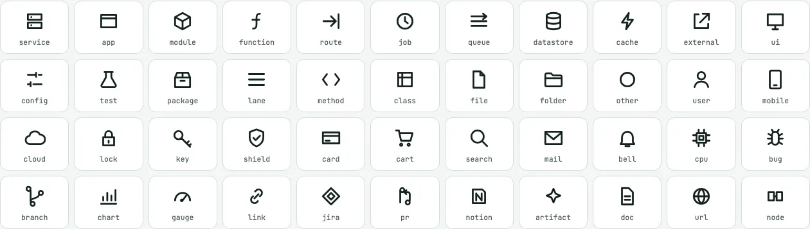
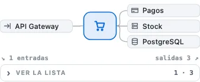

# Catálogo de assets

Todo lo que GraphX sabe dibujar, ordenado por familias. Cada familia dice qué es, para qué sirve, qué
campos del JSON la activan y dónde verla. Los efectos (cómo se comporta lo dibujado) están en
[efectos.md](efectos.md); la referencia campo a campo, en el [referencia](referencia.md#2--el-json-de-menos-a-más).

| Familia | Qué es | Se activa con |
|---|---|---|
| [1. Tarjetas](#1-tarjetas) | la pieza por defecto | nada: es lo que sale si no se dice otra cosa |
| [2. Formas](#2-formas) | 57 formas: las de Mermaid, tablas, C4, marcas, tarjetas con datos y ficheros | `shape` |
| [3. Gráficos como piezas](#3-gráficos-como-piezas) | KPI, gauge y donut | `shape: "kpi" \| "gauge" \| "donut"` |
| [4. Contenedores](#4-contenedores-carriles-grupos-y-niveles) | carriles, grupos plegables y niveles | `lanes`, `parent`, `levels` |
| [5. Aristas](#5-aristas) | conexiones con tipo, énfasis, caudal y puntas | `edges` |
| [6. Iconos](#6-iconos) | 35 tipos de pieza | `kind`, `icons` |
| [7. Bloques del panel](#7-bloques-del-panel) | 24 maneras de explicar una pieza | `blocks` |
| [8. Vistas y layouts](#8-vistas-y-layouts) | grafo, secuencia y 8 layouts propios | `flows`, `layout.mode` |
| [9. Color y temas](#9-color-y-temas) | tokens, estados, escalas y pieles | `theme`, `color`, `statuses`, `fx.skin` |

---

## 1. Tarjetas

La pieza de siempre: icono según `kind`, título (parte en dos líneas antes que ensancharse), subtítulo,
barra de acento, chip de cambio (`delta`), iconos de enlace, punto de nota, `± N` con sus ficheros y `+N`
si tiene hijos plegados (con su pila detrás). Con los datos de [graphx-fx](efectos.md) gana cinco extras
que no cambian su forma: la cifra de calor en una pastilla, una sparkline, un anillo de progreso alrededor
del icono, las iniciales de su equipo y un halo de alerta.

| Campo | Qué añade |
|---|---|
| `label` · `subtitle` · `kind` | título, subtítulo e icono |
| `delta` · `files` | el chip NUEVO/MOD/ELIM y la pastilla `± N` con el diff |
| `links` · `notes` | iconos de GitHub, Jira, Notion… y el punto de nota |
| `heat` · `spark` + `unit` · `progress` · `alert` · `owner` | los extras de graphx-fx |

## 2. Formas

Una pieza con `shape` se dibuja con esa forma en vez de con la tarjeta. Las aristas acaban en su contorno
(el vértice del rombo, el borde del círculo), no en su caja. Son funciones puras de `graphx-shapes.js`:
se ven igual en el motor y en React.

| Grupo | Formas | Para qué |
|---|---|---|
| Flujo | `rect rounded terminal subroutine datastore cylinder-h circle dcircle hexagon decision io io-l trapezoid trapezoid-t flag document cloud bang triangle triangle-down hourglass delay card text arrow-right arrow-left arrow-up arrow-down` | procesos y diagramas de flujo |
| Marcas | `start end junction choice fork commit commit-merge commit-highlight commit-reverse` | estados, uniones, ramas de git |
| Notas | `note` | aclaraciones dentro del diagrama |
| Tablas | `table` (entidad de ER), `class` (UML), `requirement` | modelos de datos y de dominio |
| Iconos | `tile` (servicio de arquitectura), `actor` | arquitectura y casos de uso |
| C4 | `person c4 c4-db c4-queue` | contexto, contenedores y componentes |
| Tarjetas con datos | `bar` (gantt), `score` (journey), `ticket` (kanban), `flowbar` (sankey), `block` (treemap) | planes, tableros, flujos con valor |
| Barras | `gbar` (gantt), `sbar` (sankey): las ponen sus layouts, a su tamaño | el eje de fechas y las cintas de valor |
| Árbol de ficheros | `file`, `folder`, `folder-open` | repositorios y diffs |

**Formas con datos.** Desde la 1.9, las formas de flujo, las baldosas, C4, tablas y notas aceptan los mismos
datos que una tarjeta: `heat`, `owner` y `alert` sobre el contorno, y `spark` y `progress` en una franja
debajo que tiene su sitio en el layout. Desde Mermaid se escriben en `@{…}` o en comentarios `%% @gx`
([efectos.md](efectos.md#formas-de-mermaid-con-datos)).

| Tablas de clases y de ER | |
|---|---|
|  |  |

## 3. Gráficos como piezas

Piezas que son un dato. Viven en el diagrama como cualquier otra (se conectan, se seleccionan, tienen panel)
y con datos en vivo (`setData` o la línea de tiempo) se animan de un valor al siguiente.

| Forma | Datos | Cuándo usarla |
|---|---|---|
| `kpi` | `value`, `unit`, `decimals`, `change` (%) con `good: "down"` si bajar es bueno, `spark` | una cifra con su tendencia: pedidos por minuto, altas del día |
| `gauge` | `value`, `min`, `max`, `unit`, `thresholds: [aviso, crítico]` con `good: "high"` si lo alto es bueno | un valor contra un límite: CPU, SLO, presupuesto de error |
| `donut` | `parts: [{ label, value, color }]`, `unit` | un reparto: tráfico por canal, coste por equipo; un `pie` de Mermaid se convierte en un donut |

## 4. Contenedores: carriles, grupos y niveles

- **Carriles** (`lanes`): fronteras que el lector reconoce (un equipo, un sistema, una capa). Con dos o más,
  aparecen los marcos de fondo con cabecera, recuento y una cabecera fija al borde al acercarse.
- **Grupos** (`parent`): una pieza con hijos se pliega y se despliega en su sitio. `frame: "dashed" | "dotted"`
  dibuja su marco discontinuo (fronteras de C4, grupos de arquitectura). `gridCols` ordena sus hijos en rejilla.
- **Niveles** (`levels`): el selector de profundidad (Capa · Servicio · Clase · Método). Las conexiones se
  escriben al nivel más profundo y suben solas al contenedor visible (`×N` si se agrupan).

## 5. Aristas

| Rasgo | Campos | Qué se ve |
|---|---|---|
| Tipo | `kind`: `call http rpc event queue data dependency render async other` | `event`, `queue` y `async` van discontinuas; el tipo decide también cómo se propaga un fallo en el [impacto](efectos.md#impacto) |
| Énfasis | `emphasis: "hero" \| "muted"` | la conexión que importa, gruesa y con halo; o la de fondo, apagada |
| Movimiento | `animated`, `speed: "fast" \| "slow"`, `rate` | una línea que fluye; con `rate`, partículas más densas y rápidas según el caudal |
| Valor | `weight`, `curve` | grosor proporcional (sankey); una curva suave (mindmap) |
| Extremos | `head`, `tail`: `arrow none triangle diamond odiamond circle cross open lollipop one zero-one one-many zero-many`; `headLabel`, `tailLabel` | herencia, composición, patas de gallo de ER, cardinalidades |
| Texto | `label`, `summary`, `data`, `trigger` | la etiqueta y lo que sale en el tooltip y el panel |

## 6. Iconos

El `kind` de una pieza elige su icono (16 × 16, en trazo). Desde la 1.9 hay 16 tipos más para mapas de
software. `icons` en el JSON añade los tuyos o redefine uno (solo comandos de path).

| Grupo | Tipos |
|---|---|
| Código y sistemas | `service app module function method class file folder route job queue datastore cache external ui config test package` |
| Software (1.9) | `user mobile cloud lock key shield card cart search mail bell cpu bug branch chart gauge` |
| Genérico | `other` (y `lane` para los carriles) |

## 7. Bloques del panel

`blocks` en una pieza añade al panel de detalle otras maneras de explicarla. Todo el texto se escapa y los
colores y las URLs solo pasan si son válidos. Fuera de un diagrama, `GraphX.fx.renderBlocks(blocks)`.

| Grupo | `type` | Para qué |
|---|---|---|
| Texto | `text` (`style`: `lead`, `muted`, `small`), `heading`, `divider`, `quote` | explicar con formato: **negrita**, *cursiva*, `código`, enlaces |
| Avisos | `callout` (`tone`: `info`, `warn`, `good`, `crit`), `badges` | lo que hay que saber antes de tocar |
| Datos | `kv`, `table` (celdas `{ v, tone }`), `stats` (con `change` y `spark`) | ficha técnica, estados, cifras con su variación |
| Gráficos | `chart` (`kind`: `line`, `area`, `bar`, `stack`), `spark`, `bars`, `progress`, `gauge`, `donut`, `kpi`, `heatstrip` | tendencias, rankings, avance, repartos y actividad por día y hora |
| Procesos | `checklist`, `steps` (`done`, `active`, `todo`), `timeline` | runbooks, rollouts, cronologías |
| Código y medios | `code` (`lang`), `image` (`data:image/…` o `https://`) | comandos, configuración, consultas, capturas |

El panel resume además la **vecindad** de la pieza como un mini-grafo (entradas · pieza · salidas, cada una
navegable), con la lista completa plegada en una línea:

## 8. Vistas y layouts

| Vista o layout | Se activa con | Para qué |
|---|---|---|
| Grafo jerárquico (ELK) | por defecto | arquitecturas, dependencias, procesos |
| Secuencia | `flows` (una pestaña por flujo) | una petición mensaje a mensaje, con «Reproducir» |
| `gantt` | `layout.mode` | tareas sobre un eje de fechas |
| `git` | `layout.mode` | ramas y commits en orden |
| `sankey` | `layout.mode` | flujos con su valor |
| `treemap` | `layout.mode` | jerarquías por tamaño |
| `timeline` · `journey` | `layout.mode` | periodos con eventos; tareas con su emoción |
| `grid` | `layout.mode` | rejillas (block-beta, la galería de piezas) |
| `tree` | `GraphX.tree.from…` | árboles de ficheros con su diff |

El conversor de Mermaid elige la vista sola.

| | |
|---|---|
|  |  |
|  |  |
|  | |

## 9. Color y temas

- **Tokens** de claro y oscuro (`theme`), heredados de la página si los define (`--ink`, `--bg`…).
- **Color por pieza**, carril, arista o mensaje (`color`, `fill`, `textColor`), como un color CSS o `{ light, dark }`.
- **Estados propios** (`statuses`) con su etiqueta, su color y, con `pulse: true`, un halo.
- **Paleta categórica** `--gx-p0…p7` (donuts, colores automáticos, equipos).
- **Escalas de calor**: `traffic` (verde → rojo, la de salud), `heat`, `cool`, `viridis`, `magma` o una lista propia.
- **Pieles** (`fx.skin`): `neon` y `blueprint` (oscuras, con su propio fondo) y `glass` (clara y oscura).
- **Tema de Mermaid**: `forest`, `neutral`, `dark` y las `themeVariables` de `base` se traducen a tokens.

| neon | blueprint | glass |
|---|---|---|
|  |  |  |
