# La página de demostración

El showcase de GraphX 1.9: una página autocontenida (motor, ELK, datos y estilos dentro) que enseña todo lo
que dibuja el motor en nueve pestañas, en castellano y en inglés. Solo dos pestañas tiran de la red: Diagramas
carga Mermaid de jsDelivr para compararlo y Formas carga React de cdnjs. Se genera con:

```bash
node tools/build-dist.mjs                                              # dist/ al día
node examples/fx/build.mjs docs/demo/es/index.html --standalone --lang es   # la demo en castellano
node examples/fx/build.mjs docs/demo/index.html --standalone --lang en      # la demo en inglés
node examples/fx/build.mjs /tmp/graphx-demo.html                       # sin esqueleto, para publicarla como artifact
```

Las dos versiones construidas están en el repositorio como demo en vivo: [`docs/demo/es/`](demo/es/index.html)
y [`docs/demo/`](demo/index.html) (con GitHub Pages sobre `/docs`, quedan en `/demo/es/` y `/demo/`).

Pesa unos 2,2 MB. Cada pestaña se monta la primera vez que se abre; la dirección recuerda la pestaña
(`#software`, `#ejemplos`, `#diagramas`, `#galeria`, `#formas`, `#arbol`, `#atlas`, `#vivo`, `#referencia`; `#mermaid`
lleva a Diagramas). Las capturas de este documento se regeneran con `node tools/capture-docs.mjs` y los GIF de
los README con `node tools/capture-gifs.mjs` (ver [README](README.md)).

**La versión inglesa.** `--lang en` traduce la plantilla con `examples/fx/showcase.en.txt` (pares de frases
exactas; el build falla si una frase ya no está en la plantilla o si queda castellano visible) y toma los
datos de `examples/en/`, que replica `examples/` con cada ejemplo traducido (mismos ids, `"lang": "en"`). Al
cambiar un texto de la página, añade su traducción al diccionario; al cambiar un ejemplo, su copia en inglés.

| Pestaña | Qué enseña |
|---|---|
| Software | el checkout de una tienda con su día de tráfico, impacto, equipos, paneles ricos y Mermaid con datos |
| Casos de uso | diez ejemplos del repositorio, de un postmortem a un plan de lanzamiento |
| Diagramas | los 19 tipos de Mermaid dibujados por GraphX y por Mermaid, con y sin efectos, colores y editor |
| Piezas | cada clase de pieza con datos en vivo, los 24 bloques del panel y los iconos |
| Formas | el catálogo de formas en React (`GraphXShape`) con estados, cambios, colores y puntas de arista |
| Árbol | este repositorio como árbol de ficheros con los cambios de la rama, o un árbol pegado |
| Atlas | la misma tienda vista desde cinco perspectivas y dos interiores, con las piezas compartidas |
| En vivo | datos que cambian cada segundo y medio, presets y efectos uno a uno |
| Guía | la clasificación de assets y efectos y la referencia de configuración |

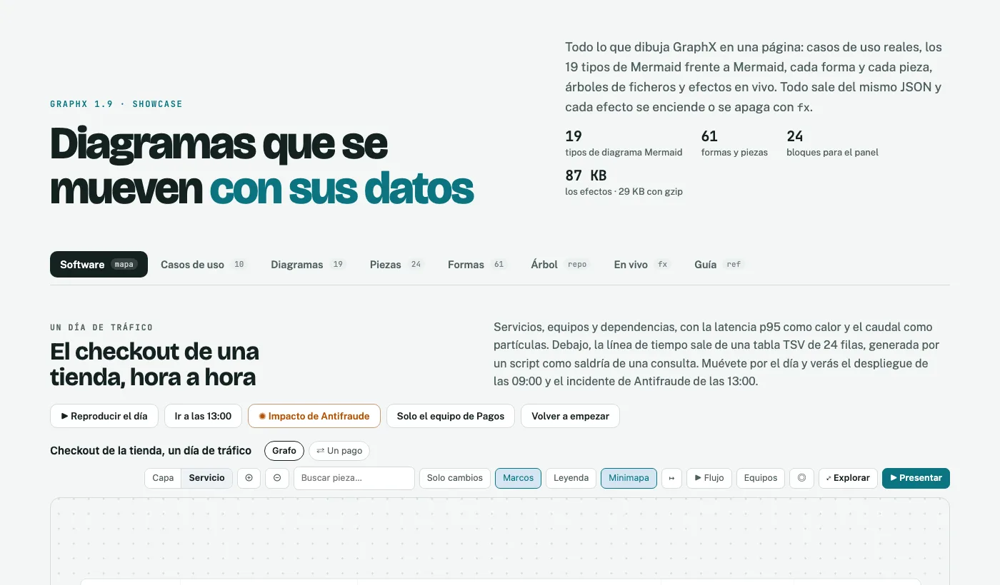

## Software

El checkout de una tienda (`examples/fx/software.json`): servicios en carriles, equipos, la latencia p95
como calor, el caudal como partículas y tres indicadores. Debajo, la línea de tiempo de un día entero sale de
una tabla TSV de 24 filas que genera `examples/fx/software/gen.mjs`.

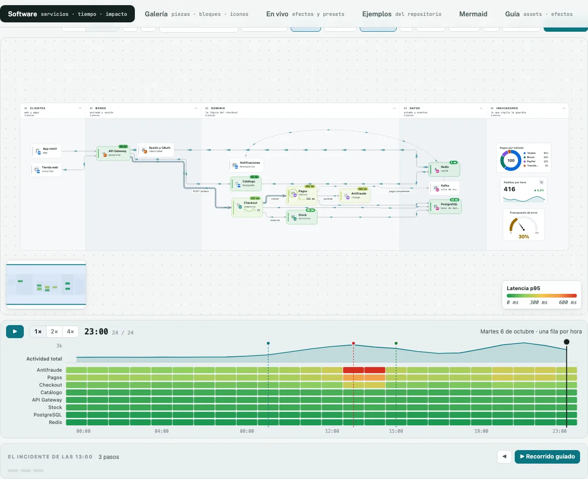

| Botón | Qué enseña |
|---|---|
| ▶ Reproducir el día | la línea de tiempo desde las 00:00: el pico de mediodía, el despliegue de las 09:00 y el incidente |
| Ir a las 13:00 | cruza el evento del incidente: Antifraude y Pagos en rojo, el aviso arriba |
| ✺ Impacto de Antifraude | el radio de impacto: anillos por salto y el resumen en el panel |
| Solo el equipo de Pagos | el filtro de equipos |
| Volver a empezar | todo como al abrir |

Pulsa cualquier pieza para ver su panel: Pagos lleva un aviso, cifras con su serie, la latencia del día,
sus SLO, el comando de rollback, un runbook y sus últimos cambios; Checkout, la saga de la compra, sus
endpoints más lentos y sus errores; PostgreSQL, su CPU y la carga de la semana.

| El panel de Pagos | El incidente de las 13:00 |
|---|---|
|  |  |


Debajo, **Mermaid, igual de rico**: `examples/fx/arquitectura.mmd`, un flowchart válido con datos de GraphX
en `@{…}` y en comentarios `%% @gx` (resaltados en el código).

## Galería

Las 28 clases de pieza en una rejilla (`examples/fx/galeria.json`, layout `grid`), con datos que cambian
cada dos segundos. Cada pieza lleva en su panel un tipo de bloque distinto. Después, todos los bloques del
panel uno a uno (`examples/fx/bloques.json`, pintados con `GraphX.fx.renderBlocks`) y los 35 iconos de tipo,
que se dibujan al pasar por encima.

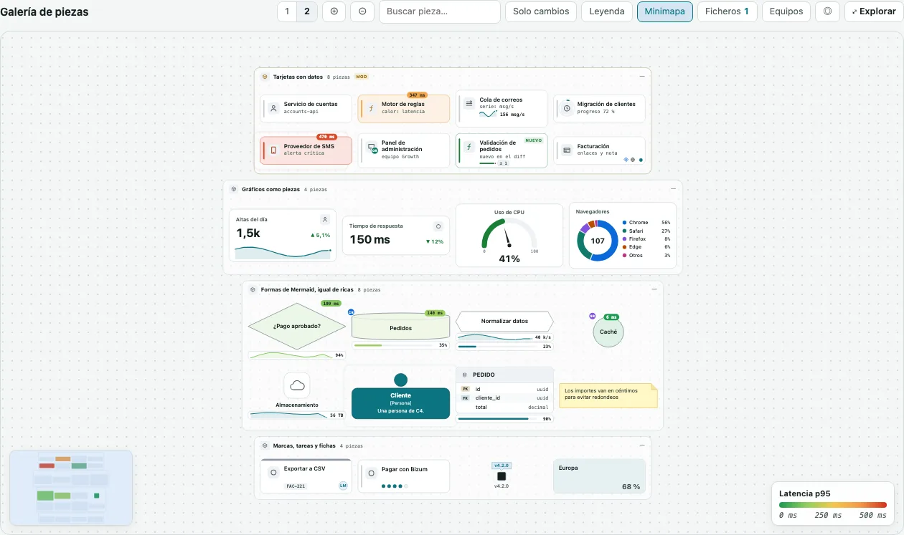

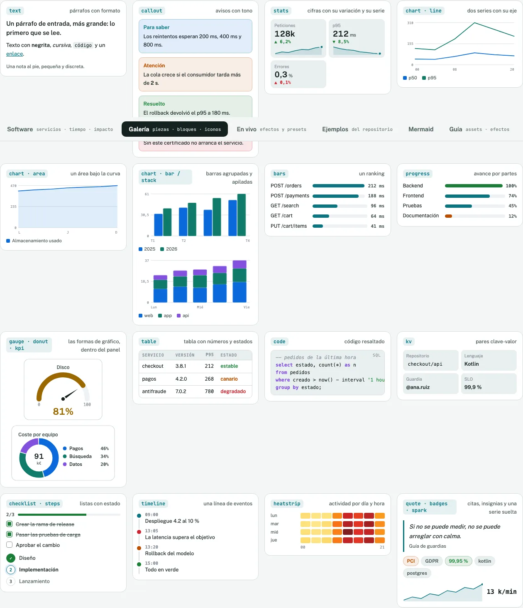

## En vivo

Una plataforma de pagos que recibe datos nuevos cada segundo y medio. Arriba, los presets y un interruptor
por efecto; la línea de código muestra el `fx` que resulta. «Provocar un incidente» dispara la latencia de
Antifraude y traza lo que depende de él. Debajo, el almacén (un proceso de negocio con KPIs) y la revisión de
una PR de 73 piezas con el preset `vivid` (zoom semántico, marcha al pasar, minimapa plegable).

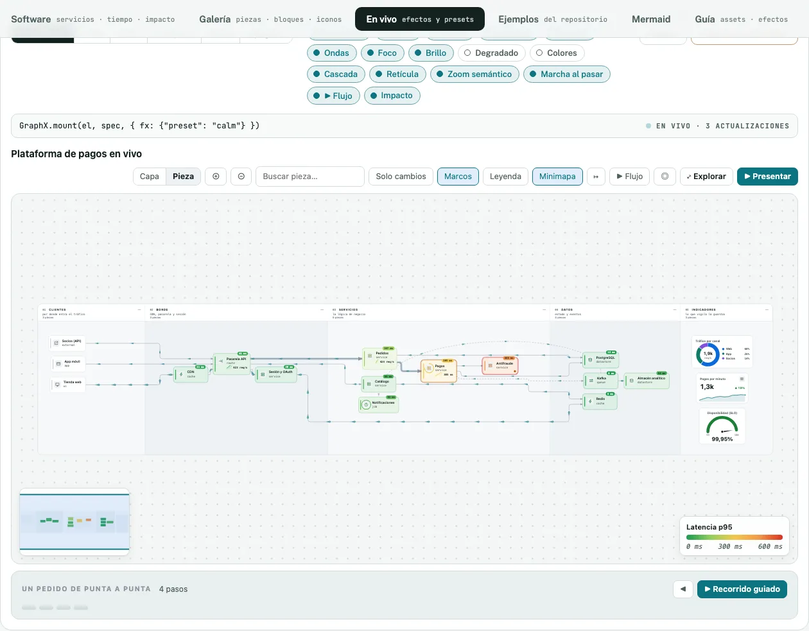

## Casos de uso

Diez ejemplos del repositorio, cada uno con lo que demuestra y su fichero; al elegirlo se monta al lado (el
visor se queda fijo al bajar por la lista). Ver [ejemplos.md](ejemplos.md).

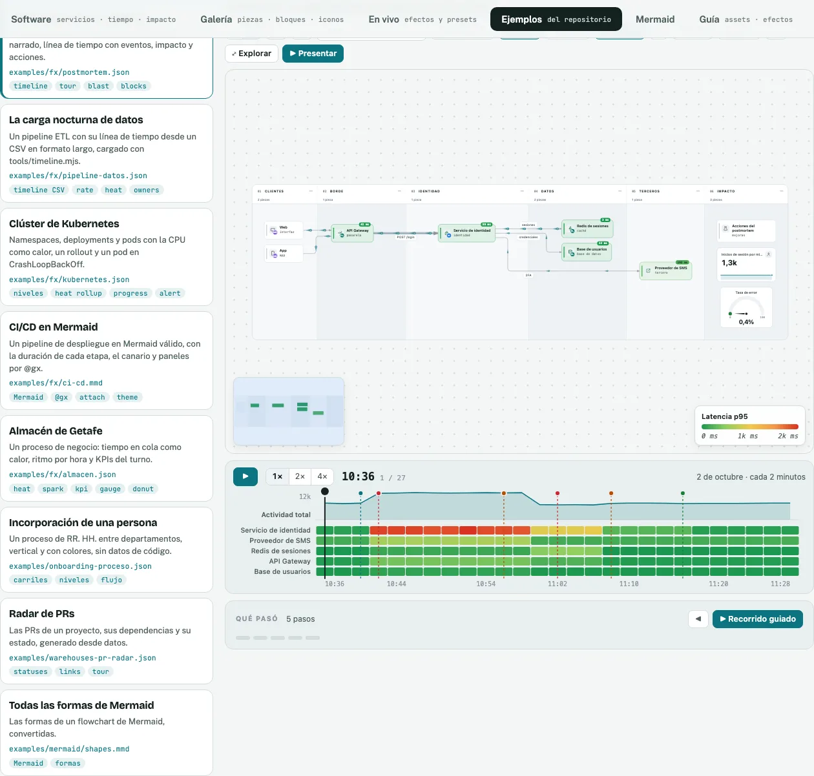

## Diagramas

Los 19 tipos de Mermaid (`examples/mermaid/*.mmd`) y tres más con datos de GraphX (`@{…}` y `%% @gx`). Cuatro
vistas: solo GraphX, GraphX y Mermaid lado a lado (Mermaid 11.17 desde jsDelivr), con y sin efectos (`fx: false`
frente al preset elegido) y solo Mermaid. Los efectos se eligen arriba (apagados, por defecto, vivid, neon,
blueprint, glass); «Colores» cambia los tokens del tema y el color de cada tipo de pieza en vivo; «Editar el
código» abre el editor (Ctrl + Enter convierte). Un `pie` se dibuja como una pieza `donut`.

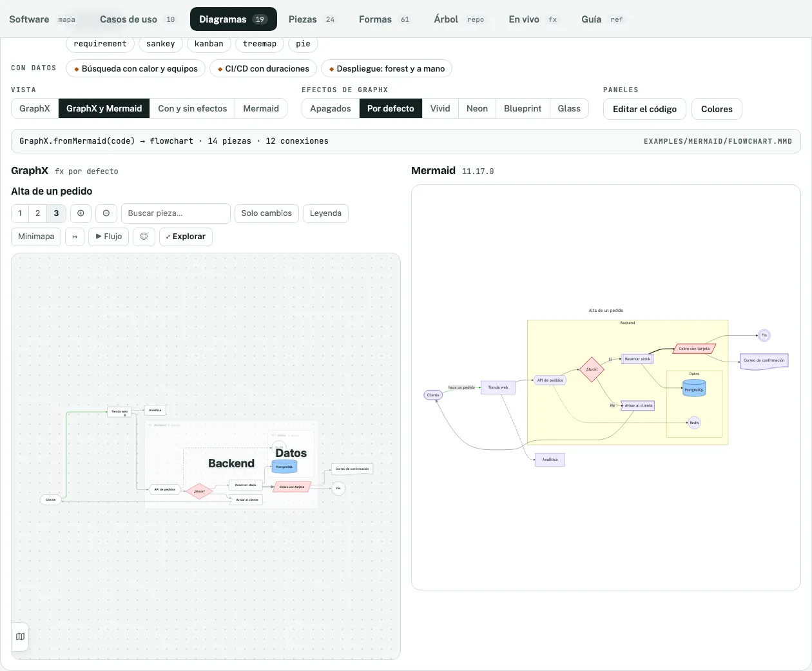

## Formas

Cada forma de `graphx-shapes.js` dibujada suelta con el componente `GraphXShape` de React, agrupada por familia
(flujo, gráficos, tarjetas con datos, tablas, C4, iconos, marcas, notas, barras y ficheros) y con cómo se pide
desde Mermaid o el JSON. Arriba se cambia el estado (normal, iluminada, seleccionada), el cambio (nueva,
eliminada), el color y el sentido; al final, las puntas de arista.

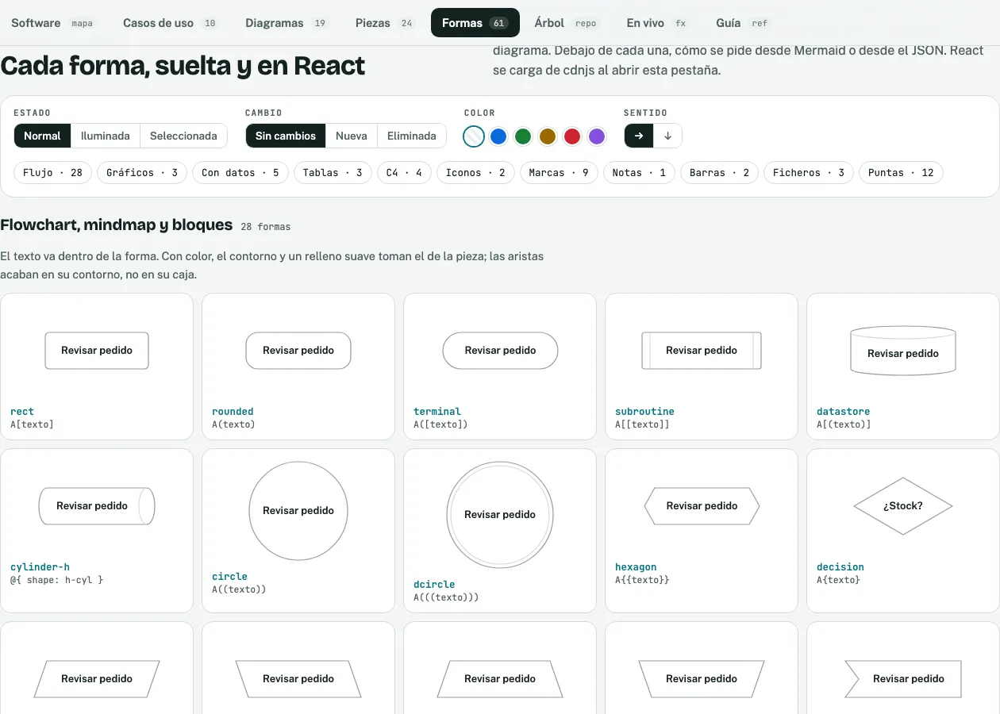

## Árbol

Este repositorio como árbol de ficheros (`tools/tree-spec.mjs`, con los cambios confirmados de la rama
respecto a `main`) o un árbol pegado: la salida de `tree`, una ruta por línea o un `git diff --numstat`. Se
navega con el teclado y se puede ver con otra piel.

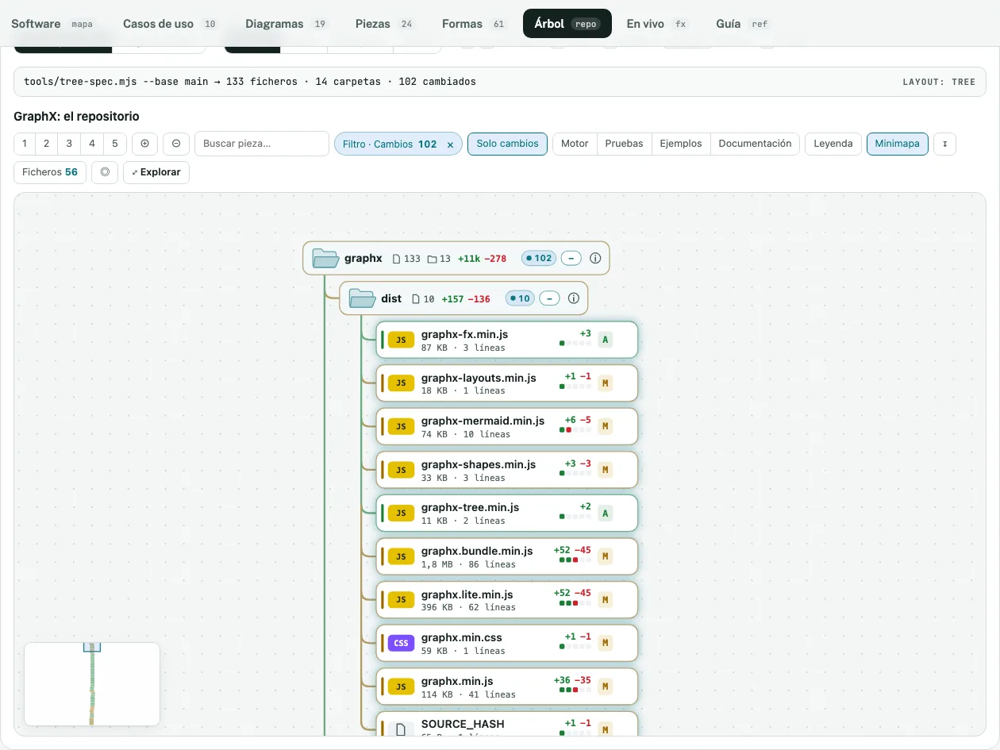

## Atlas

Varias perspectivas del mismo sistema en una sola vista (`examples/fx/atlas.json`, montado con
`examples/fx/atlas.js`): arquitectura con calor y partículas, el ciclo de un pedido como secuencia, el flujo de
datos con su línea de tiempo, el radio de impacto en piel neón y los cambios de un sprint como diff; y por dentro,
Pagos en blueprint y los estados de un pedido desde Mermaid. Las piezas se declaran una vez (`entities`) y cada
perspectiva las usa por id: su ficha dice en qué otras aparece y salta a ellas, con su contexto, restricciones,
riesgos y pendientes. «Por dentro ▸» entra con un zoom desde la pieza; `1`–`7` cambian de perspectiva y `/` busca.
`node examples/fx/build-atlas.mjs [atlas.json] <página>.html [--lang en]` hace una página suelta con cualquier atlas.

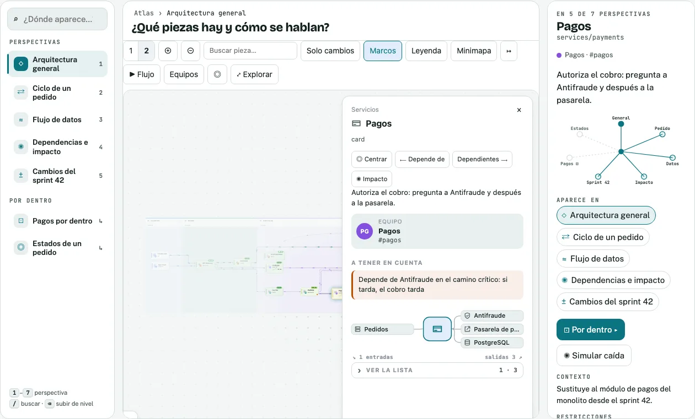

## Guía

La clasificación de lo que se puede dibujar y de los efectos, con «Ver →» hacia la pestaña donde se ve cada
cosa, y la referencia de configuración (presets, equipos y bloques, línea de tiempo, Mermaid con datos, API).

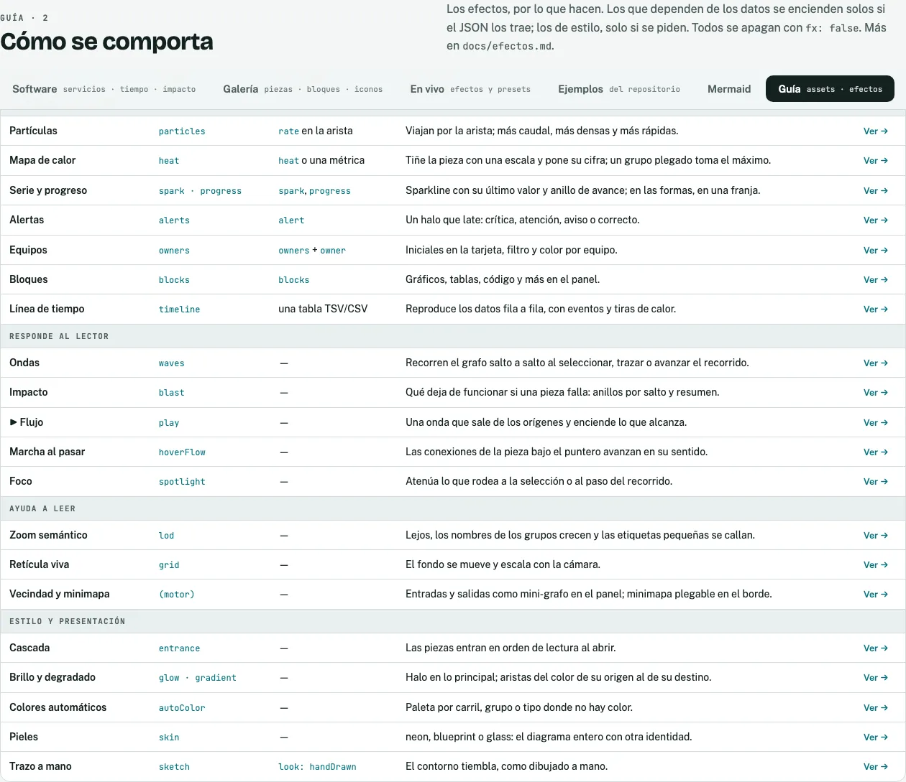
