# Efectos y datos en vivo

`graphx-fx.js` es un módulo opcional: si está cargado (los dos bundles de `dist/` lo llevan), el motor lo
engancha; si no, nada cambia. Este documento los clasifica por lo que hacen, dice qué pide cada uno y cómo
se configura. Lo que se puede dibujar está en [catalogo.md](catalogo.md).

- [Cómo se configura](#cómo-se-configura)
- [1. Lo dibujan los datos](#1-lo-dibujan-los-datos): partículas, calor, series y progreso, alertas, equipos, bloques, línea de tiempo, formas con datos
- [2. Responde al lector](#2-responde-al-lector): ondas, impacto, ▶ Flujo, marcha al pasar, foco
- [3. Ayuda a leer](#3-ayuda-a-leer): zoom semántico, retícula viva, vecindad, minimapa plegable
- [4. Estilo y presentación](#4-estilo-y-presentación): cascada, brillo, degradado, colores automáticos, pieles, trazo a mano
- [Datos en vivo desde JS](#datos-en-vivo-desde-js) · [Recetas](#recetas) · [Coste y accesibilidad](#coste-y-accesibilidad)

## Cómo se configura

`fx` va en la raíz del JSON, en las opciones de montaje o en el atributo `data-fx` de la página. Las capas
se aplican en ese orden y la última manda: quien monta el diagrama puede apagar lo que pide el JSON.

```json
"fx": false                                    // nada: el diagrama exactamente como sin el módulo
"fx": "vivid"                                  // un preset
"fx": { "preset": "neon", "glow": false, "heat": { "label": "Latencia p95", "unit": "ms" } }
```

```js
GraphX.mount(el, spec, { fx: 'off' });         // la página manda sobre el JSON
```

| Preset | Qué enciende |
|---|---|
| *(sin `fx`)* · `calm` | las mejoras discretas (ondas, marcha al pasar, retícula, zoom semántico, impacto, minimapa plegable) y lo que piden los datos |
| `vivid` | además partículas en lo animado y lo principal, cascada, foco, brillo, degradado, colores automáticos y «▶ Flujo» |
| `neon` · `blueprint` · `glass` | `vivid` con su piel |
| `present` | foco, cascada, partículas y brillo, para presentar |
| `off` · `false` | nada |

Cada efecto también se enciende o se apaga por su clave (`{ "glow": false }`). La tabla completa de claves y
valores por defecto está en el [README, §8](../README.md#8--efectos-y-datos-en-vivo-graphx-fxjs).

---

## 1. Lo dibujan los datos

Se encienden solos cuando el JSON trae el dato y no se ven si no lo trae. Son la parte útil para
representar información: el mismo diagrama pasa de mapa a cuadro de mando.

### Partículas

| Clave | Pide | Por defecto |
|---|---|---|
| `particles` | `rate` en la arista (y, con `true`, también las `animated` y las `hero`) | solo las aristas con `rate` |

Viajan por la arista en su sentido; su densidad y su velocidad crecen con el caudal relativo. `speed`
(`fast`, `slow` o un factor) las acelera o las frena. Hay un presupuesto (`{ max: 260 }`): primero las
aristas que cuentan la historia. Se paran fuera de pantalla.

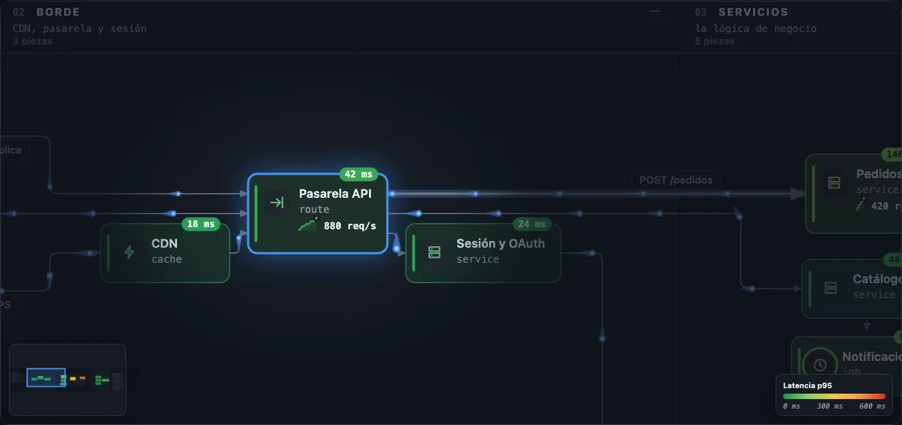

### Mapa de calor

| Clave | Pide | Por defecto |
|---|---|---|
| `heat` | `heat` en la pieza, o una métrica: `{ metric: "p95" }` lee `metrics` | si hay datos |

Tiñe cada pieza con una escala continua y pone su cifra en una pastilla sobre el borde. `{ label, unit,
domain: [min, max], scheme, invert, rollup }`: escalas `traffic` (salud: verde → rojo), `heat`, `cool`,
`viridis`, `magma` o una lista de colores. Un contenedor plegado toma el máximo de lo que lleva dentro
(`rollup: "max" | "avg" | "sum" | false`). La escala aparece en el lienzo, en la leyenda y en el minimapa.

### Serie y progreso

| Clave | Pide | Por defecto |
|---|---|---|
| `spark` · `progress` | `spark: [números]` + `unit`; `progress` de 0 a 1 (o 0–100) | si hay datos |

La serie, como sparkline con su último valor bajo el subtítulo (la tarjeta crece lo justo). El progreso,
como un anillo alrededor del icono, verde al completarse.

### Alertas

| Clave | Pide | Por defecto |
|---|---|---|
| `alerts` | `alert: "crit" \| "warn" \| "info" \| "ok"`, o un estado de `statuses` con `pulse: true` | si hay datos |

Un halo que late alrededor de la pieza, del color de su gravedad.

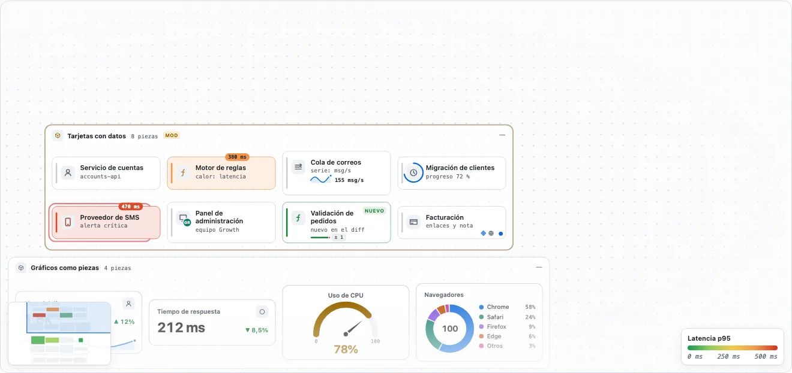

### Equipos

| Clave | Pide | Por defecto |
|---|---|---|
| `owners` | `owners: { id: { label, short, color, contact, url } }` en la raíz y `owner` en piezas o carriles (lo heredan sus hijos) | si hay datos |

Las iniciales del equipo sobre el icono, su nombre en el tooltip y su contacto en el panel. «Equipos» en
la barra filtra por uno o varios (lo de otros equipos se apaga; las dependencias entre equipos quedan a media
luz), encuentra lo que no tiene dueño («Sin equipo») y colorea por equipo.

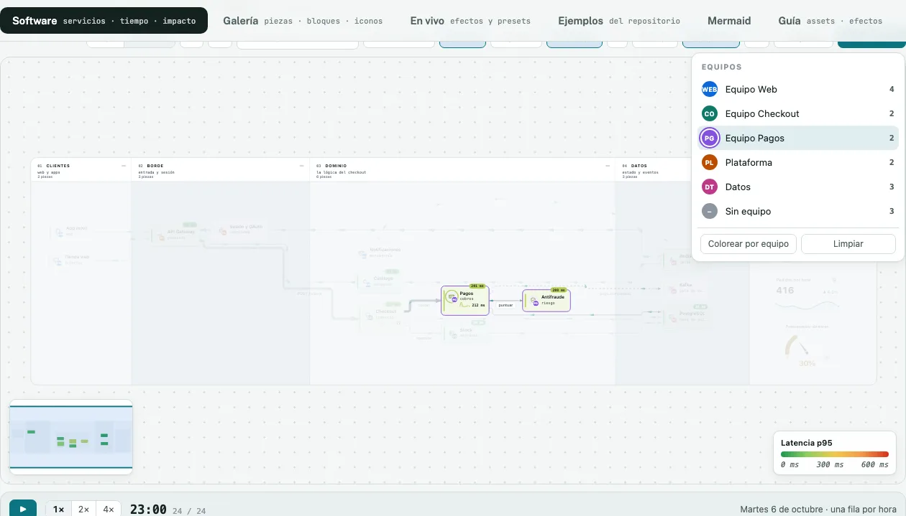

### Bloques

| Clave | Pide | Por defecto |
|---|---|---|
| `blocks` | `blocks: [{ type, … }]` en la pieza | si hay datos |

24 tipos de contenido para el panel: texto con formato, avisos, código resaltado, tablas, cifras con su
variación, gráficos de líneas, áreas y barras, rankings, gauge, donut, checklists, pasos, eventos y
actividad. Ver el [catálogo](catalogo.md#7-bloques-del-panel).

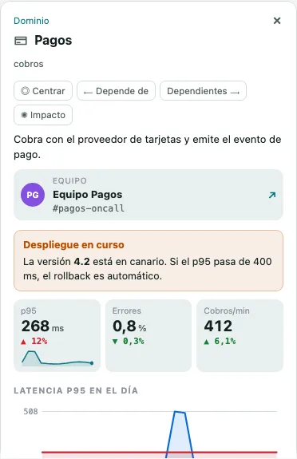

### Línea de tiempo

| Clave | Pide | Por defecto |
|---|---|---|
| `timeline` | `timeline: { data: "TSV o CSV", events, label, step, window, start }` en la raíz | si hay datos |

Una banda bajo el lienzo: la actividad total (la suma de los caudales), una tira de calor por pieza, los
eventos marcados y un cursor que se arrastra. Reproducir (1×, 2×, 4×) aplica cada fila con `setData`: el
diagrama entero se mueve con el día. Cruzar un evento lo anuncia y hace latir sus piezas.

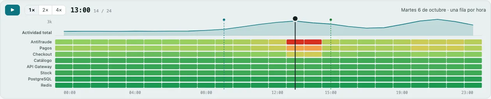

**De una consulta al diagrama.** La tabla puede venir en formato ancho (una columna por serie,
`<id>.<campo>`) o largo (`time · id · field · value`, lo que devuelve un `GROUP BY`):

```csv
time,id,field,value
02:00,limpieza,heat,6.2
02:00,ing-clean,rate,840
02:10,limpieza,heat,6.9
```

```bash
node tools/timeline.mjs examples/fx/pipeline-datos.json datos.csv --events eventos.tsv
```

`tools/timeline.mjs` comprueba que cada serie apunte a una pieza o arista y escribe la tabla en `timeline`.
Campos: `heat`, `rate`, `value`, `progress`, `change`, `spark` (ventana de las últimas `window` filas),
`weight`, `alert`. La fila de partida (`start: "end" | "start"`) se aplica antes del primer layout.

### Formas de Mermaid con datos

| Clave | Pide | Por defecto |
|---|---|---|
| `attach` | `spark` o `progress` en una forma de flujo, baldosa, C4, tabla o nota | sí |

Las formas reciben los mismos datos que una tarjeta: calor, equipo y alerta sobre el contorno; la serie y
el progreso en una franja debajo, con su sitio en el layout. Desde Mermaid, sin dejar de ser Mermaid válido:

```
api@{ shape: hex, label: "API", heat: 85, spark: "40 52 61 58", owner: busqueda, progress: 0.5 }
e1@{ rate: 900, speed: fast }
%% @gx { "owners": { "busqueda": { "label": "Equipo Búsqueda" } }, "fx": { "particles": true } }
%% @gx api { "blocks": [ { "type": "callout", "tone": "warn", "text": "Reindexado en curso" } ] }
```

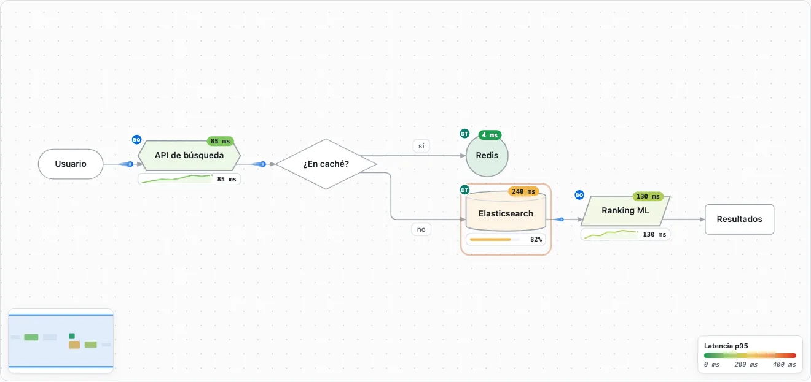

---

## 2. Responde al lector

Efectos que aparecen cuando el lector hace algo. Dan sentido a la interacción: dicen qué está conectado
con qué, en qué sentido y hasta dónde llega.

### Ondas

`waves` (sí por defecto). Una onda que recorre el grafo salto a salto: un salto al seleccionar, todos al
trazar «de qué depende» (a favor de las aristas) o «qué depende de esto» (a contracorriente), y las aristas
de cada paso del recorrido.

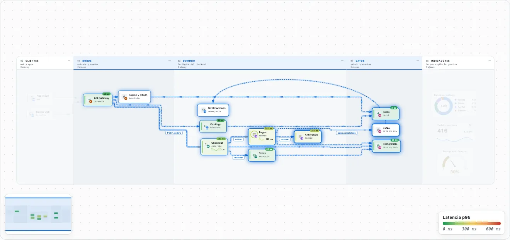

### Impacto

`blast` (sí por defecto). «✺ Impacto» en el panel, o `g.blast(id)`: qué deja de funcionar si esa pieza
falla. Anillos por salto con su recuento, piezas teñidas por distancia (rojo, naranja, ámbar) y, en el
panel, cuántas piezas, cuántos saltos y qué equipos toca. En una llamada (`call`, `http`, `rpc`, `data`…)
el fallo sube hacia quien llama; en un `event`, `queue` o `async` baja hacia quien consume.
`{ mode: "auto" | "callers" | "downstream" | "both" }` lo cambia.

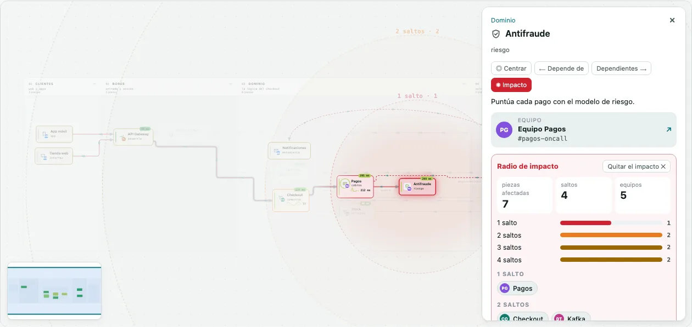

### ▶ Flujo

`play` (no por defecto; sí en los flowchart y los diagramas de estados convertidos de Mermaid). Un botón
que lanza una onda desde los orígenes del grafo: lo que aún no ha alcanzado espera apagado.
`{ hop, loop, from }`; `g.playFlow()` desde JS.

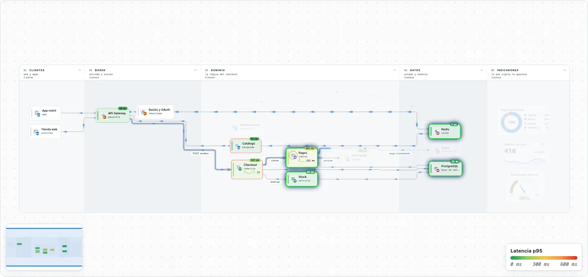

### Marcha al pasar y foco

- `hoverFlow` (sí): al pasar por una pieza, sus conexiones iluminadas marchan en su sentido.
- `spotlight` (no): atenúa lo que rodea a la pieza seleccionada o a lo que enseña el paso del recorrido.

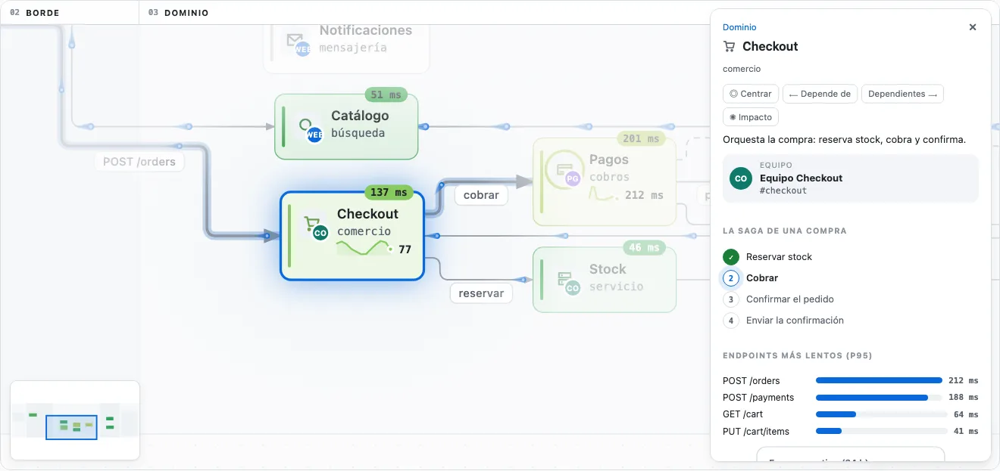

---

## 3. Ayuda a leer

Mejoras discretas para cualquier diagrama, encendidas por defecto.

| Efecto | Clave | Qué hace |
|---|---|---|
| Zoom semántico | `lod` (`{ k: 0.4 }`) | por debajo de ese zoom, los nombres de los contenedores abiertos crecen hasta leerse y las etiquetas pequeñas se ocultan |
| Retícula viva | `grid` | el fondo de puntos se mueve y se escala con la cámara |
| Vecindad | (motor) | entradas y salidas en el panel como mini-grafo, la lista plegada |
| Minimapa plegable | (motor) | cerrado, una pestaña en el borde; al pasar se despliega y la chincheta lo fija |

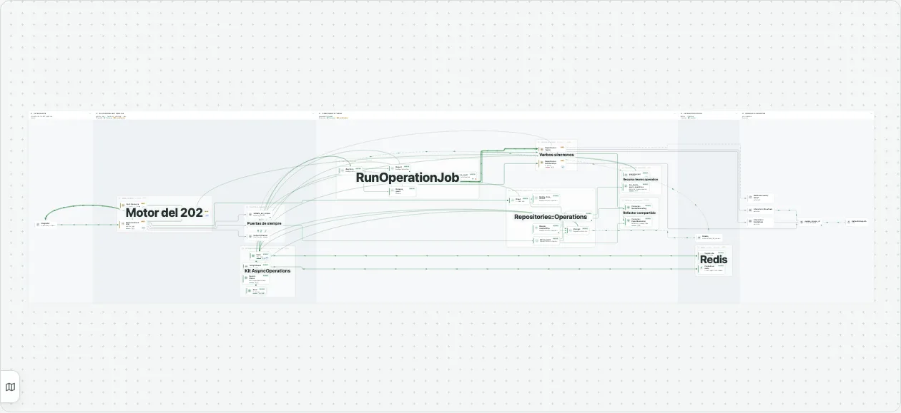

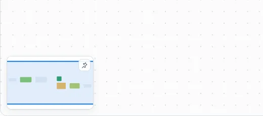

---

## 4. Estilo y presentación

Apagados por defecto: cambian el aspecto, así que se piden (o vienen en un preset).

| Efecto | Clave | Qué hace |
|---|---|---|
| Cascada | `entrance: "cascade"` | al abrir, las piezas entran en orden de lectura y las aristas detrás |
| Brillo | `glow` | halo en las aristas principales e iluminadas y en la selección |
| Degradado | `gradient` | cada arista va del color de su origen al de su destino |
| Colores automáticos | `autoColor: "auto" \| "lanes" \| "groups" \| "kinds"` | la paleta donde no hay color (no en un diff) |
| Pieles | `skin: "neon" \| "blueprint" \| "glass"` | el diagrama entero con otra identidad |
| Trazo a mano | `sketch` | el contorno tiembla; lo enciende `look: handDrawn` de Mermaid |

| neon | blueprint | glass |
|---|---|---|
| 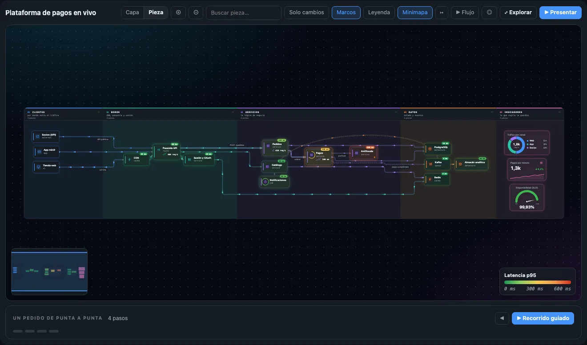 | 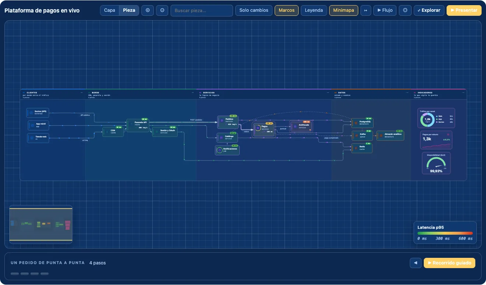 | 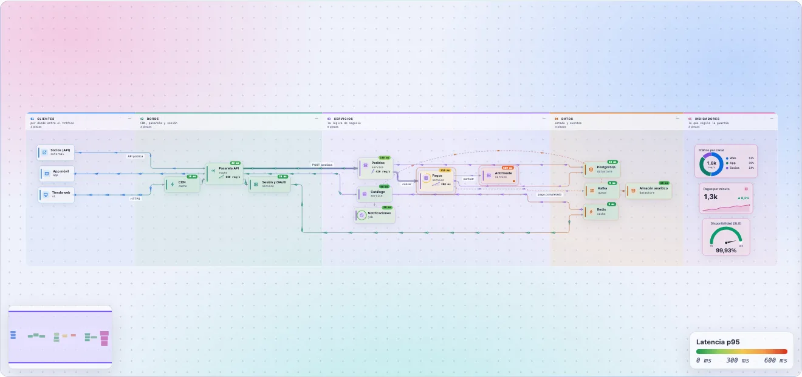 |

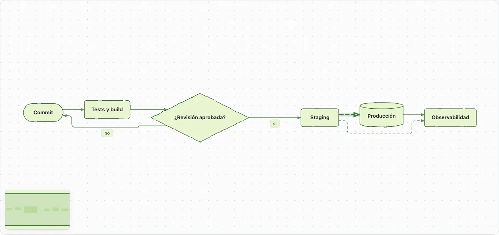

---

## Datos en vivo desde JS

```js
const g = GraphX.mount(el, spec, { fx: 'vivid' });
g.setData({ nodes: { pagos: { heat: 180, progress: .9 } }, edges: { 'e-co-pay': { rate: 240 } } });
g.timeline.seek('13:00'); g.timeline.play(); g.timeline.pause();
g.blast('antifraude'); g.clearBlast();
g.filterOwners(['pagos']); g.colorOwners(true);
g.playFlow({ from: 'web' }); g.stopFlow();
```

`setData` rehace cada pieza en su sitio y la anima de un dibujo al siguiente: las cifras cuentan, las
series y los arcos se deslizan y el color de calor transita. Si el cambio mueve el layout (una etiqueta,
una serie nueva), recoloca.

## Recetas

| Quiero… | Cómo |
|---|---|
| un mapa de servicios que se lea como un cuadro de mando | `heat` con `scheme: "traffic"`, `rate` en las aristas, `spark` en las piezas clave y tres piezas `kpi`/`gauge`/`donut` en un carril «Indicadores» ([software](../examples/fx/software.json)) |
| reproducir un día o un incidente | una tabla TSV/CSV en `timeline` con `events` ([postmortem](../examples/fx/postmortem.json), [pipeline](../examples/fx/pipeline-datos.json)) |
| saber qué se cae si algo falla | nada: «✺ Impacto» está en el panel; tipa bien las aristas (`event` frente a `call`) |
| repartir responsabilidades | `owners` + `owner` en carriles o piezas; «Equipos» filtra y colorea |
| explicar una pieza en profundidad | `blocks` con su runbook, sus SLO, su código y sus gráficas |
| enriquecer un Mermaid existente | `@{ heat, spark, owner, progress }` y `%% @gx` ([CI/CD](../examples/fx/ci-cd.mmd)) |
| presentar | `fx: "present"` y un `tour` |
| que no se mueva nada | `fx: false`, o el sistema con `prefers-reduced-motion` |

## Coste y accesibilidad

- `graphx-fx.min.js` pesa 87 KB (29 KB con gzip) y trae sus estilos. Sin él, el motor es el de siempre.
- Las partículas usan SMIL (`animateMotion`), se paran fuera de pantalla y tienen un presupuesto.
- Con `prefers-reduced-motion` no hay partículas, ondas, cascada ni latidos; los datos se siguen viendo.
- El color nunca es el único canal: el calor lleva su cifra, la alerta su texto en el tooltip y el impacto su recuento.
