<div align="center">

# graphx · el mod de GraphX para Claude Code

**Cualquier diagrama de GraphX dentro de Claude Code, en cada superficie y a cualquier tamaño.**
Claude lo dibuja con herramientas; tú lo navegas con el teclado y el ratón.


<sub>Todas las capturas son del lienzo de verdad (<code>hooks/canvas.tsx</code>) con escenas del motor, grabadas con
<code>node mod/tools/capture-media.mjs</code>.</sub>

</div>

<table>
<tr>
<td width="33%" valign="top">
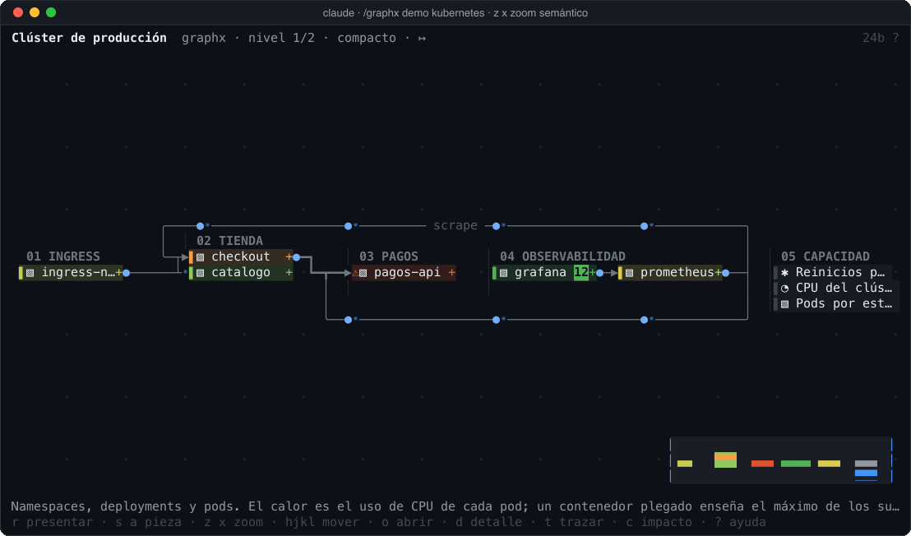<br>
<b>🔍 Zoom semántico</b> <code>z</code> <code>x</code><br>
<sub>tarjetas, fichas, compacto y vista general, cada uno colocado por ELK para su tamaño</sub>
</td>
<td width="33%" valign="top">
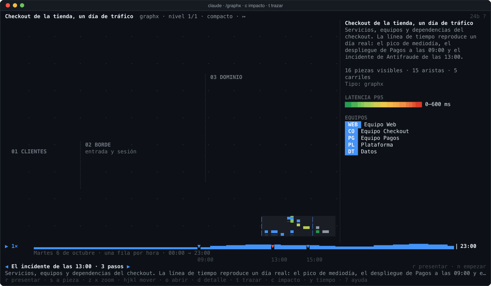<br>
<b>✺ Impacto y trazado</b> <code>c</code> <code>t</code><br>
<sub>qué deja de funcionar si cae Antifraude, salto a salto</sub>
</td>
<td width="33%" valign="top">
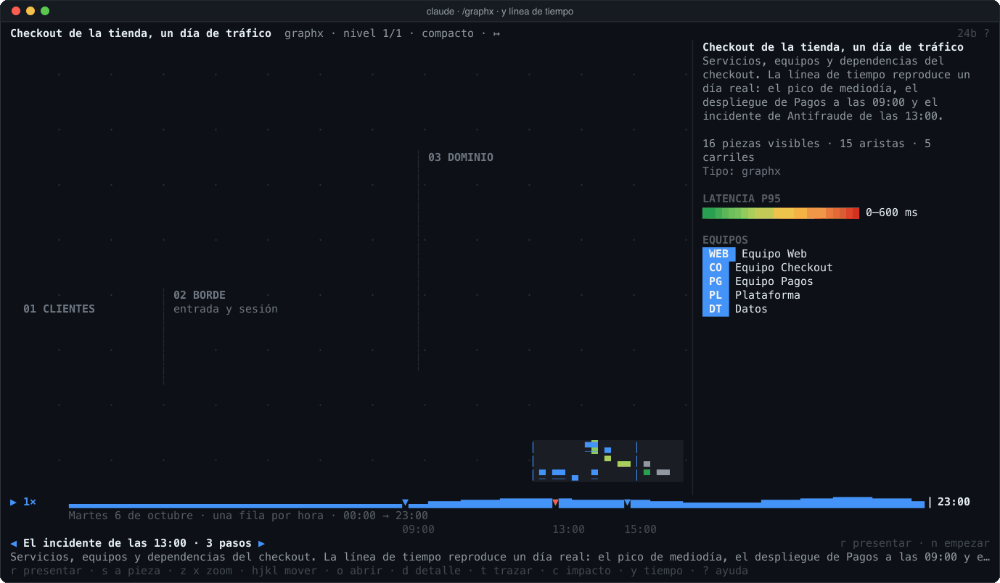<br>
<b>⏱ Línea de tiempo</b> <code>y</code><br>
<sub>un día de tráfico con su calor, su caudal y el incidente de las 13:00</sub>
</td>
</tr>
<tr>
<td width="33%" valign="top">
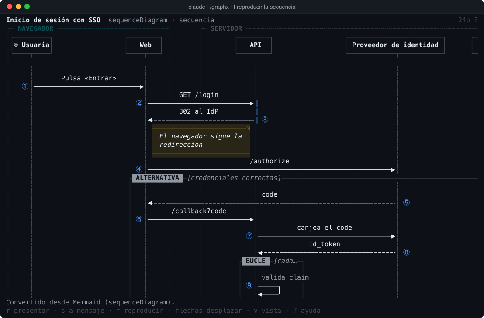<br>
<b>▶ Secuencias</b> <code>f</code><br>
<sub>los mensajes salen uno a uno, con sus bloques <code>alt</code> y <code>loop</code></sub>
</td>
<td width="33%" valign="top">
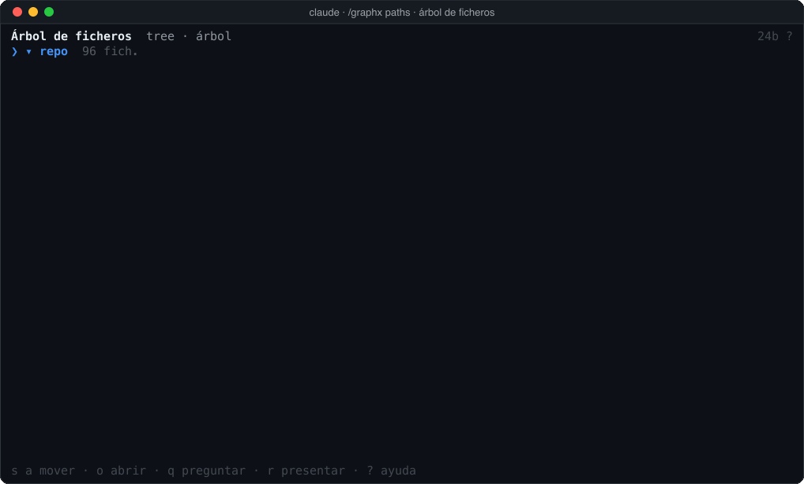<br>
<b>🗂 Árboles de ficheros</b> <code>o</code> <code>q</code><br>
<sub>carpetas que se abren en su sitio; <code>q</code> pregunta a Claude por la fila</sub>
</td>
<td width="33%" valign="top">
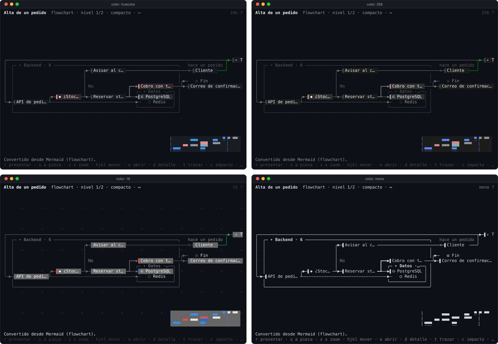<br>
<b>🎨 Se adapta al terminal</b><br>
<sub>color, caracteres, tema, imágenes y ratón, detectados al arrancar</sub>
</td>
</tr>
</table>

```sh
node mod/build.mjs && claude --plugin-dir mod/graphx     # y en la sesión: /graphx demo software
```

---

<details>
<summary><h3>📥 Cargarlo</h3></summary>

```sh
node tools/build-dist.mjs          # si dist/ no está al día
node mod/build.mjs                 # copia el bundle al visor y empaqueta jsdom para el servidor (ignorados por git)
claude --plugin-dir mod/graphx     # o: node mod/build.mjs --to <carpeta de mods de la sesión> [--watch]
```

Hace falta `node` en el PATH. Con `rsvg-convert` (librsvg) hay además imagen del motor para kitty/Ghostty/WezTerm, la
foto en medios bloques y la captura que ve Claude con `view`.

</details>

<details>
<summary><h3>🖥 El terminal, a cualquier tamaño</h3></summary>

| | |
|---|---|
| Tamaño | micro (< 40 col.) y estrecho (< 64): el **esquema**, en filas, con los datos de cada pieza y sus conexiones; normal: el grafo; ancho (≥ 132 × 18): el grafo y el **panel lateral** con el detalle y sus bloques |
| Zoom semántico | el grafo se coloca otra vez con ELK en unidades de celda: **tarjetas** (1:1, con sus datos), **fichas**, **compacto** y, si nada cabe, la **vista general** encajada; `z` `x` (`+` `−`) pasan de uno a otro sin perder la pieza en foco |
| Imagen | `i`: en kitty, Ghostty y WezTerm, el PNG del motor; en los demás de 24 u 8 bits, la foto del motor en medios bloques |
| Ratón | en pantalla completa: clic, doble clic, arrastrar, pasar por encima (tooltip y aristas que marchan), clic derecho para preguntar |
| Movimiento | partículas por caudal, alertas que laten, ondas, cascada, ▶ flujo, línea de tiempo; menos fotogramas por SSH o en tmux; `u` los reduce o los para |

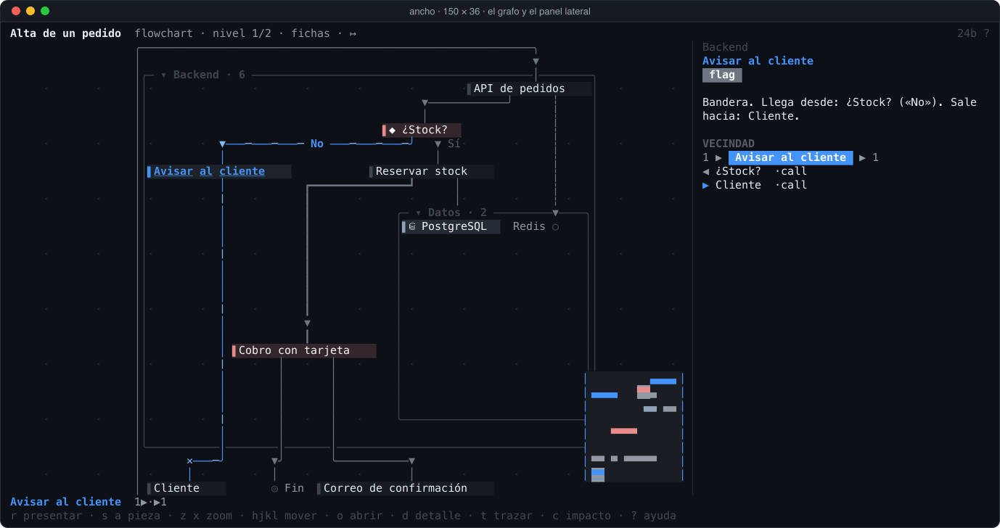

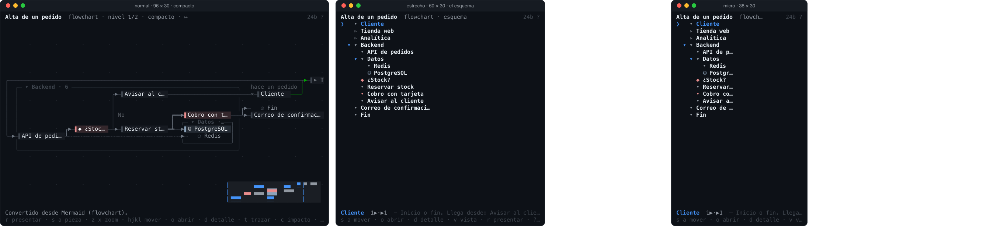

</details>

<details>
<summary><h3>🎨 Color, caracteres y tema</h3></summary>

| | |
|---|---|
| Color | truecolor · 256 (paleta xterm exacta) · 16 (por tono, con los colores del tema del terminal) · sin color (negrita, atenuado, inverso) |
| Caracteres | unicode con braille (curvas, series finas) · básico (consola de Linux) · ASCII |
| Tema | oscuro o claro, el de Claude Code |

Lo detecta solo al arrancar (`TERM`, `COLORTERM`, `TERM_PROGRAM`, `NO_COLOR`, `FORCE_COLOR`, la configuración regional,
tmux/screen/zellij, SSH, el tema de Claude Code…) y `/graphx caps` dice qué ha visto y por qué; `/graphx caps
color=256 glyphs=ascii motion=off theme=light` (o las opciones del mod en `/config`) lo fuerzan.


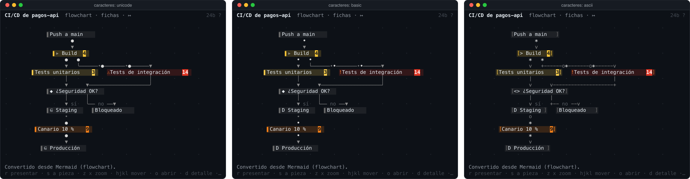

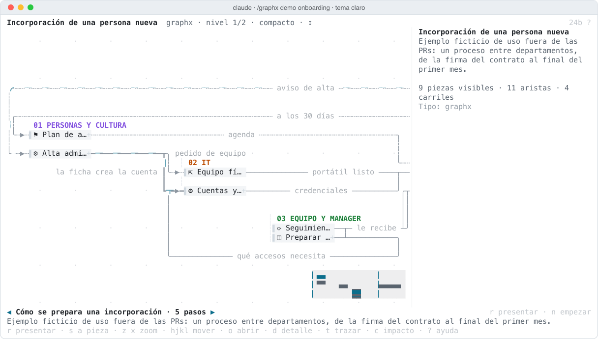

</details>

<details>
<summary><h3>⌨️ Teclado y presentación</h3></summary>

Un solo mapa, en minúsculas, igual con el foco en el lienzo (un clic) que en el panel (`ctrl+x tab`, o al abrirlo con
`/graphx`, que ya le da el teclado; `Esc` lo devuelve al prompt). Con el panel enfocado aparece una barra con un botón
por atajo, así que sin ratón también se maneja todo:

| | |
|---|---|
| `r` | **presentación**: el recorrido paso a paso con su explicación abajo y la cámara centrada en cada paso, con el zoom más legible en el que cabe; si el diagrama no trae recorrido, uno automático (la visión general y una pieza —o un mensaje— por paso, en el orden en que fluye) |
| `n` `b` (→ ← en la presentación) | paso siguiente · anterior |
| flechas · `h j k l` · `z` `x` (+ −) · `0` | mover · acercar, alejar · encuadrar |
| `s` `a` (tab · mayús+tab) · `o` (⏎) · `d` (espacio) | pieza siguiente, anterior · abrir o plegar · detalle |
| `1–9` · `g` · `v` · `/` | niveles · orientación · vista (grafo, esquema, flujos) · buscar |
| `t` · `c` · `f` · `y` `,` `.` | trazar · ✺ impacto · ▶ flujo o reproducir la secuencia · línea de tiempo |
| `e` · `m` · `u` · `q` · `w` · `i` · `?` | equipos · minimapa · efectos · preguntar a Claude · navegador · imagen · ayuda |

Una tecla sin uso en la vista lo dice en el pie. Claude también puede abrir la presentación (`guide` con `present: true`)
y tú con `/graphx present`.

</details>

<details>
<summary><h3>🧰 Lo que hace Claude</h3></summary>

| Herramienta | Para qué |
|---|---|
| `show` | Dibuja: `spec` (JSON de GraphX), `mermaid` (19 tipos, con datos en `@{…}` y `%% @gx`), `paths`, `tree_text` o `file`. `fx` elige los efectos. |
| `patch` | Lo cambia sin rehacerlo: `add`, `update`, `remove`, `set`. |
| `data` | Datos en vivo sin recolocar (el `setData` del motor): calor, series, progreso, alertas, caudal… |
| `signs` | Carteles anclados, sueltos o de un paso, y un banner. |
| `guide` | Recorrido (`steps`, `go`) y vista: `focus`, `select`, `trace`, `depth`, `direction`, `flow`, `blast`, `owners`, `timeline`. |
| `view` | Qué hay pintado, la captura PNG del motor y, con `text: true`, el panel del terminal tal como lo ve la persona. |
| `convert` | Mermaid → GraphX con el inventario de sus anotaciones; GraphX → Mermaid con las suyas. |
| `export` | El diagrama del lienzo como Mermaid con todo lo añadido (parches, datos) en `%% @gx`. |
| `capabilities` | Qué se puede dibujar y cómo se verá en cada superficie, con lo detectado de este terminal. |
| `reference` | La chuleta del formato. |

Los bloques ` ```mermaid ` de las respuestas de Claude se dibujan con GraphX en el propio transcript (opción `inline`).

</details>

<details>
<summary><h3>🪟 Escritorio, editor, móvil y navegador</h3></summary>

**Escritorio, editor y móvil.** El SVG del motor (con sus partículas SMIL y sus latidos CSS, podado para caber en el
límite del elemento) con los controles del recorrido, los niveles, la orientación y los flujos, un selector de piezas y
su detalle en Markdown. En el escritorio, «Celdas» enseña el mismo lienzo que el terminal.

<picture>
  <source media="(prefers-color-scheme: dark)" srcset="docs/img/escritorio-dark.png">
  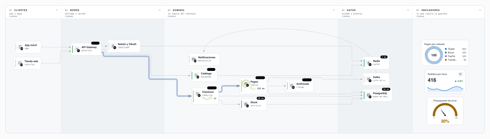
</picture>

**Navegador.** `/graphx open`: el motor de verdad, interactivo, con los carteles y lo que Claude va cambiando.

</details>

<details>
<summary><h3>🧜 Mermaid de ida y vuelta</h3></summary>

Los 19 tipos de Mermaid se dibujan en el terminal con su propia forma: barras de gantt con el día de hoy, ramas
de git, clases, entidades, mapas mentales, donuts, sankey, journeys, tableros kanban, líneas de tiempo, C4 y
arquitectura.

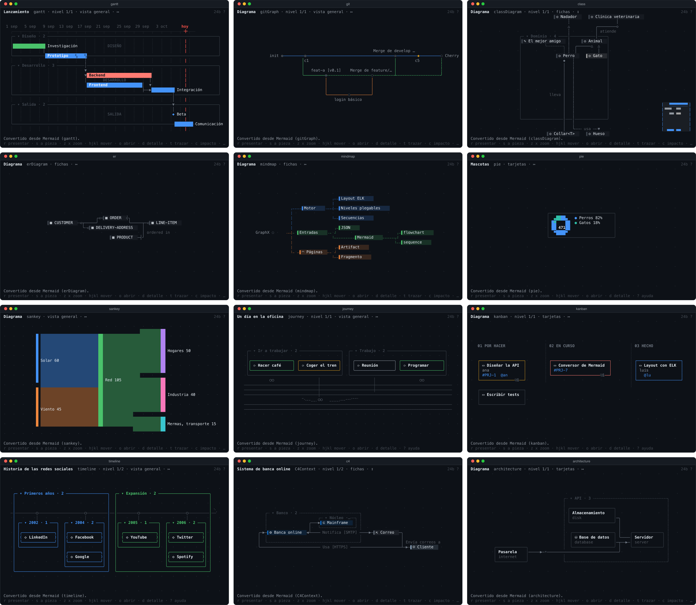

- **Recoger**: `convert` (o `show` con `mermaid`) lee los 19 tipos y dice qué anotaciones de GraphX lleva cada pieza,
  arista y la raíz: las claves que Mermaid no conoce en `id@{ heat: 85, spark: "1 2 3", owner: pagos }` y el JSON de
  `%% @gx [id] {…}` (bloques, métricas, enlaces, formas que Mermaid no tiene, `fx`, equipos, línea de tiempo, recorrido…).
- **Expresar**: `export` y `convert` con `spec` escriben Mermaid válido que el conversor vuelve a leer igual: un
  `flowchart` con sus subgraphs, formas, trazos, colores y datos, o un `sequenceDiagram`.

</details>

<details>
<summary><h3>🏗 Cómo está hecho</h3></summary>

```
Claude ──herramientas──▶ hooks (register.tsx, $.state) ──HTTP──▶ server/live.mjs ── engine.mjs: GraphX en jsdom
                                   │                                    │  ├─ la escena (geometría + datos de efectos)
   terminal ◀── Client (canvas.tsx: caracteres, efectos animados) ◀─────┤  ├─ ELK otra vez, en unidades de celda
   escritorio ◀── Svg del motor (animaciones CSS y SMIL) + controles ◀──┤  ├─ SVG autocontenido · PNG (rsvg-convert)
   kitty/Ghostty ◀── Image (PNG) · otros 24 bits ◀── Raster (medios ▀) ◀┤  └─ Mermaid ⇄ GraphX con anotaciones
   navegador ◀── viewer/ (el motor de verdad, interactivo) ◀── SSE ─────┘
```

| Fichero | |
|---|---|
| `graphx/hooks/register.tsx` | herramientas, `/graphx`, el panel por superficie, el render de los bloques Mermaid, la línea de estado |
| `graphx/hooks/canvas.tsx` | el lienzo del terminal (módulo `Client`): tamaños, vistas, teclado, ratón, reloj de las animaciones |
| `graphx/hooks/term/` | `caps` (detección), `paint` (color por profundidad), `glyphs`, `grid` (rejilla de celdas con aristas por bits y braille), `graph` (grafo, formas, efectos), `seq`, `lists` (árbol y esquema), `detail` (panel y bloques), `charts`, `snapshot` |
| `graphx/hooks/catalog.ts` | el mapa de capacidades y la chuleta |
| `graphx/server/engine.mjs` | el motor en jsdom: la escena, los layouts en celdas (ELK), el detalle, la conversión, los diagramas en línea |
| `graphx/server/svgout.mjs` | tokens por tema y piel (cascada CSS), SVG autocontenido, PNG, foto en medios bloques |
| `graphx/server/mermaid-out.mjs` | anotaciones de Mermaid y GraphX → Mermaid |
| `graphx/server/live.mjs` | el servidor HTTP local (token por sesión; se va con su proceso padre) |
| `graphx/viewer/` | el visor del navegador |

</details>

<details>
<summary><h3>🛠 Desarrollo</h3></summary>

```sh
npm run mod:test                                            # claude plugin validate + claude plugin test
node mod/tools/term-preview.mjs examples/fx/software.json --cols 140 --rows 40 --keys "+,tab,b" --png /tmp/f.png
node mod/tools/term-preview.mjs examples/mermaid/gantt.mmd --cols 80 --rows 24 --color 16 --glyphs ascii
node mod/tools/gen-fixtures.mjs                             # las escenas de verdad que usan las pruebas
node mod/tools/capture-media.mjs [nombre…]                  # las capturas y los GIF de este README (rsvg-convert + ffmpeg)
```

`term-preview` monta el lienzo con una superficie simulada y pinta sus fotogramas en ANSI (o en PNG, para revisarlos
como imagen, o en GIF con `--gif` y un guion de teclas y esperas) a cualquier tamaño, color, juego de caracteres y
tema, con teclas, clics y tiempo.

</details>
