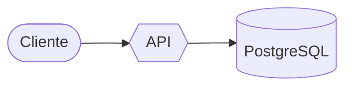

# Diagramas con GraphX

Las herramientas `mcp__graphx__*` dibujan con el motor de GraphX y lo enseñan donde esté la persona: en el panel del
terminal (caracteres, con color, braille y efectos animados, adaptado al tamaño y a lo que sabe pintar su terminal), en
la app de escritorio (el SVG del motor) y en el navegador (`/graphx open`).

## Cómo trabajar

1. **Elige el diagrama** con `capabilities` si dudas: 19 tipos de Mermaid, el grafo de GraphX (carriles, niveles
   plegables, datos), el árbol de ficheros (`paths`). Un grafo para arquitectura y dependencias; `sequenceDiagram` para
   «quién llama a quién y en qué orden»; `stateDiagram` para ciclos de vida; `gantt` para planes; `paths` para un repo o
   un diff.
2. **Dibuja** con `show` (`mermaid`, `spec`, `paths`, `tree_text` o `file`). Etiquetas cortas (≤ 24 caracteres) y un
   `summary` en cada pieza: en el terminal cada caja mide lo que su texto.
3. **Guía** con `guide` (un recorrido de 3–6 pasos que cuente qué pasa, qué viaja y qué lo dispara; `focus`, `trace`,
   `blast` para el radio de impacto, `flow` para abrir una secuencia) y con `signs` (pocos carteles: riesgos,
   decisiones, preguntas).
4. **Datos**: `heat`, `spark`, `progress`, `alert`, `rate` en las aristas, `owner` y `blocks` en el panel; `data` los
   cambia en vivo sin recolocar. `fx: "vivid"` (o `neon`, `blueprint`, `glass`, `present`) para presentar.
5. **Comprueba** con `view` (`text: true` enseña el panel del terminal tal como lo ve la persona; la imagen, el motor).
6. **Mermaid de ida y vuelta**: `convert` lee un Mermaid y dice qué anotaciones de GraphX lleva; `export` escribe el
   diagrama como Mermaid con todo (datos en `id@{…}`, el resto en `%% @gx`).

Los bloques ```mermaid de tus respuestas también se dibujan con GraphX en el transcript: válidos para algo rápido;
para algo que vas a cambiar o recorrer, el lienzo.

## Mermaid con datos de GraphX (sigue siendo Mermaid válido)



`reference` tiene el formato completo.
